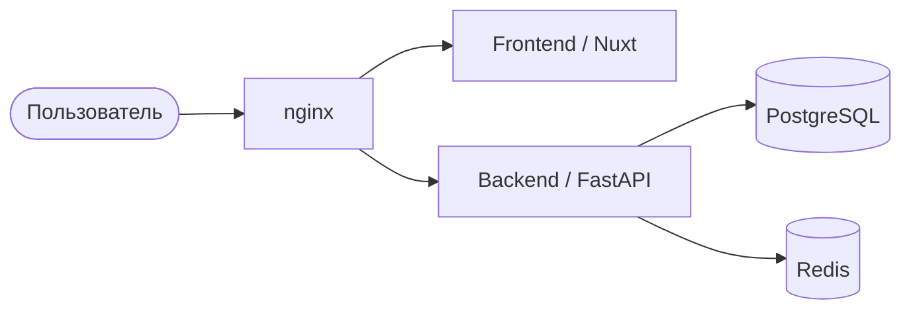

# Документация для архитекторов

Архитектура системы, ключевые решения и ограничения.

## Разделы

- **Обзор архитектуры** — контекст и контейнеры (модель C4).
- **Спецификация системы World-Gen** — конвейер, шина латентов, интеграция бэкбонов: [`system/`](system/README.md).
- **ADR** — Architecture Decision Records в `adr/` (по одному файлу на решение).
- **Интеграции** — внешние системы, протоколы, контракты.
- **Нефункциональные требования** — производительность, безопасность, масштабирование.

> Обоснования решений («почему так») — в [research/](../research/README.md);
> пошаговый путь к целевой системе — в [base-plans/](../base-plans/README.md).

## Стек (текущий)

| Слой       | Технология                          |
| ---------- | ----------------------------------- |
| Frontend   | Nuxt 4, TypeScript, Pinia           |
| Backend    | FastAPI, SQLAlchemy 2 (async)       |
| БД / кэш   | PostgreSQL 16, Redis 7              |
| Прокси     | nginx                               |
| Оркестрация| Docker Compose                      |

## Контейнерная схема (C4, упрощённо)

