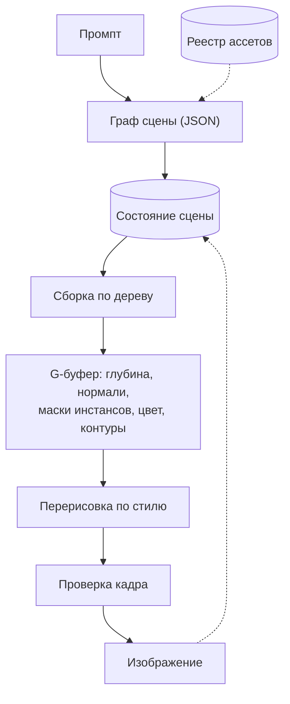

# Архитектура World-Gen

Как система устроена по состоянию на август 2026. Это описание «что есть»;
статусы решений и открытые вопросы — в [Roadmap](../../base-plans/Roadmap.md),
что строится прямо сейчас — в [Roadmap-MVP](../../base-plans/Roadmap-MVP.md).

---

## 1. Задача и разделение ответственности

Система генерирует изображения сцен, в которых персонажи и объекты **остаются
собой** между кадрами, ракурсами и сюжетными репликами. Именно это, а не
качество отдельной картинки, — предмет работы: одиночную красивую иллюстрацию
дешевле получить чистой диффузией.

Отсюда главная граница ([ADR 0002](../adr/0002-style-comes-from-project-assets.md)):

| | Кто определяет | Что входит |
| --- | --- | --- |
| **Содержание** | система | геометрия, композиция, расстановка, идентичность объектов, физика |
| **Облик** | пользователь | стиль: пресет или собственные референсы, применяется перерисовкой финального рендера |

Содержание даёт гарантии, которых генератор дать не может. Облик — пользовательская
ручка, не зависящая от наполнения: одна библиотека ассетов обслуживает любое
число обликов.

## 2. Поток данных

Пунктиром — то, что не течёт вперёд по конвейеру: реестр отдаёт ассеты по
запросу, а состояние сцены обновляется результатом, чтобы следующая реплика
пользователя правила его, а не порождала мир заново.

## 3. Компоненты

### 3.1 Граф сцены

Промпт разбирается языковой моделью не в свободный текст, а в структуру:
объекты, связи между ними, камера, свет. Каждое существительное затем
**разрешается** в реестре, и это две разные операции:

- **Именованное** («персонаж N») — точный поиск по идентификатору. Подбор
  похожего запрещён: молча возвращённый «похожий персонаж» — дефект, который
  замечают через десяток кадров. Не нашлось — ошибка.
- **Безымянное** («замок») — семантический поиск в пределах сеттинга проекта.
- **Промах** — генерация ассета и регистрация с новым идентификатором; дальше он
  полноправный и переиспользуемый.

### 3.2 Реестр ассетов

Хранит паспорта объектов. Паспорт разложен на независимые каналы, чтобы поза,
внешний вид и повреждения менялись, не задевая идентичность:

| Канал | Содержит |
| ----- | -------- |
| Геометрия | форма объекта |
| Внешний вид | материалы и палитра, правятся отдельно от формы |
| Риг | скелет и веса скиннинга; поза — углы суставов |
| Физсвойства | масса, упругость, трение, порог разрушения |

Библиотека **неизменяема**: обновление ассета сдвигает всё, что на него
ссылается, поэтому нужны версии и пиннинг версии в сцене.

### 3.3 Состояние сцены

Второй уровень хранения, в отличие от реестра — **изменяемый**: текущие позы,
контакты, повреждения, обломки, скорости. Версионируется, ветвится под сюжетные
линии.

Два свойства, которые легко упустить:

- **Ассет и инстанс — разные сущности.** Два одинаковых стула — один ассет и два
  инстанса со своими состояниями.
- **Результат симуляции запекается, а не пересчитывается.** Симуляция не
  воспроизводится бит-в-бит между запусками; пересчёт при обращении к версии
  сдвинул бы обломки, и уже показанный пользователю кадр перестал бы совпадать.

### 3.4 Структура сцены: дерево плюс граф

**Дерево** держит пространственную иерархию — трансформы наследуются вниз, и
посох в руке персонажа буквально является потомком кости кисти. Деревья
работают на четырёх уровнях сразу: граф сцены, композиция сложного ассета
(замок → крылья → башни → окна), скелет, ветки сюжета.

**Графа отношений** поверх дерева требует всё, что в иерархию не укладывается:
контакт, опора, окклюзия, физические связи между «братьями». «Персонаж лежит на
земле» — не отношение родителя и потомка.

Отсюда сборка «как конструктор»: сцена и сложный ассет собираются из каталога
деталей. Условие — детали должны иметь точки соединения с правилами, иначе
автоматическая сборка выдаёт башню, растущую из ворот боком.

### 3.5 Рендер

Выдаёт не картинку, а **набор проходов**: глубину, нормали, маски инстансов,
цвет, контуры. Они не побочный продукт, а основной: именно они удерживают
генератор от выдумывания композиции.

Два уровня по стоимости:

- **Превью** — секунды, для подбора камеры и композиции.
- **Финал** — минуты, с перерисовкой. Без этого разделения каждая правка камеры
  стоила бы полного прогона генератора.

### 3.6 Перерисовка по стилю

Генератор работает в режиме img2img поверх рендера, а не из шума, со
структурными условиями из G-буфера и стилевым референсом пользователя.

**Поводок пространственно неоднороден:** короткий на героях (защищены масками
инстансов), длинный на фоне, где идентичность никто не отслеживает.

Обусловливание диффузии остаётся мягким — гарантировать нельзя, можно только
сузить и проверить постфактум. Поэтому за перерисовкой стоит **проверка**:
детектор и VLM сверяют кадр с графом сцены (те ли объекты, столько ли, там ли),
не сошлось — перегенерация.

### 3.7 Физика

Симуляция считается на том же представлении, что и рендер, и **включается на
кадр, а не является обязательной стадией**. Причина в разделе 5.

## 4. Стек

| Слой | Решение | Статус |
| ---- | ------- | ------ |
| 3D-сборка и рендер | Blender headless, EEVEE, Python | принято под MVP |
| Маски инстансов | Cryptomatte | принято |
| Генерация 3D-ассетов | внешний API | принято |
| Сервис сцены | `backend/` — FastAPI, Postgres, Redis | продумано |
| Редактор сцены | `frontend/` — Nuxt | продумано |
| Воркер | `engine/` | продумано |
| Формат сцены | JSON; USD — кандидат на потом | продумано |
| Рантайм прода | Godot — отложенный вариант | продумано |

Ключевое требование к связности: **сцена описывается данными, рендерер их
потребляет**. Логики сцены внутри рендер-скрипта нет — иначе смена рендерера
перестаёт быть правкой одного модуля.

Веб-стек репозитория получает смысл именно здесь: `backend/` хранит граф сцены и
реестр, держит очередь заданий на рендер, отдаёт превью; `frontend/` — редактор;
`engine/` исполняет задания.

## 5. Что стоит дорого и что решает консистентность

Разбор по двум осям — стоимость вычислений и вклад именно в консистентность —
дал результат, определяющий приоритеты (подробно:
[Roadmap, раздел 17](../../base-plans/Roadmap.md#17-критический-разбор-вычисления-против-консистентности)):

- **Консистентность обеспечивают дешёвые компоненты**: разрешение по
  идентификатору, постоянный ассет, состояние сцены, геометрический рендер. Всё
  это вычислительно почти бесплатно.
- **Самый дорогой компонент на кадр — генератор — консистентности не помогает, а
  угрожает.** Он в системе ради красоты; остальное существует, чтобы его
  ограничить.
- Отсюда: **удешевление и надёжность направлены в одну сторону.** Короче поводок
  и меньше шагов — одновременно дешевле и консистентнее. Это основной вектор
  оптимизации.
- **Физика дорога и отвечает за другую ось.** Для продукта с изображениями
  «упал» — это поза, «разрушен» — вариант ассета. Симуляция окупается там, где
  важен точный физический исход.
- Настоящая стоимость системы лежит в подготовке ассетов и амортизируется:
  экономика зависит от коэффициента переиспользования, а не от GPU на кадр.

## 6. Известные ограничения

- **Гарантий от диффузии нет** — обусловливание мягкое; отсюда проверяющий цикл.
- **Хрупкое разрушение** с правдоподобными текстурами на сколах — открытая
  исследовательская проблема; обход на первое время — заготовленные варианты
  разрушения вместо симуляции.
- **Огонь как процесс** (горение → изменение материала → потеря прочности)
  готового решения не имеет.
- **Авто-риггинг** надёжен на гуманоидах и ломается на нестандартной топологии.
- **Стили, жульничающие с геометрией** (лицо не в перспективе, глаза одного
  размера с любого ракурса) не сводятся в одну модель из противоречащих видов —
  принятое ограничение.
- **Система не реального времени.** Playable-скорость — только через дистилляцию
  в быструю модель, отдельной поздней задачей.

## 7. Альтернатива, которая не отвергнута

Игровой движок с лёгким нейропроходом поверх может оказаться дешевле и надёжнее
собственного 3D-стека — движок зрелый, а своё пишется. Плата — меньше
«искусственного интеллекта» в системе и требование настоящего 3D-контента.
Аргумент усилился после разбора из раздела 5: раз всё ценное делают дешёвые
классические компоненты, довод «взять готовый зрелый движок для дешёвой части»
становится весомее.
