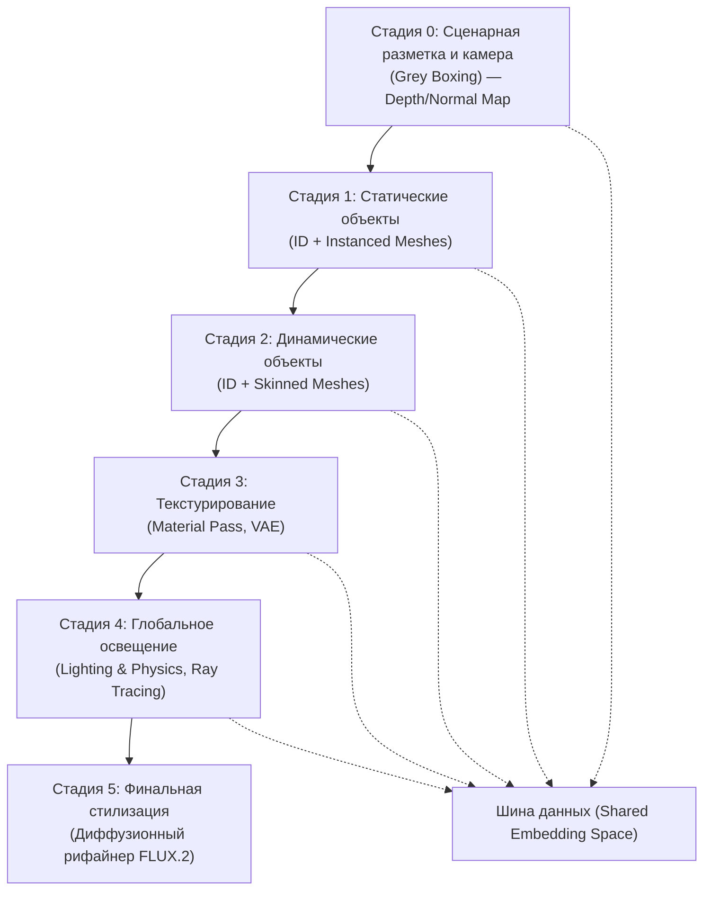

# Архитектура нейронного игрового движка: интеграция экосистемы FLUX.2 Klein и универсальных визуальных бэкбонов DINOv3 в модульных конвейерах генерации миров

Современная область генеративного искусственного интеллекта переживает фундаментальную трансформацию, переходя от монолитных моделей «черного ящика» к модульным, многостадийным архитектурам, которые имитируют традиционные конвейеры компьютерной графики и разработки игр. Этот сдвиг обусловлен необходимостью преодоления «галлюцинаций» и отсутствия контроля, характерных для одноэтапных диффузионных систем.

В центре этой эволюции находится концепция нейронного игрового движка (Neural Game Engine), построенного на высокоскоростных трансформерах выпрямленного потока (Rectified Flow Transformers), таких как `FLUX.2 [klein]`, и мощных бэкбонах самообучающегося зрения, представленных семейством `DINOv3`. Данный отчет представляет собой глубокий технический анализ интеграции этих систем в единый конвейер `World-Gen`, обеспечивающий беспрецедентный уровень консистентности, физической достоверности и интерактивности.

## Техническая архитектура и варианты моделей экосистемы FLUX.2 [klein]

Семейство моделей `FLUX.2 [klein]`, разработанное Black Forest Labs (BFL), представляет собой вершину интерактивного визуального интеллекта. В отличие от традиционных диффузионных моделей, использующих итеративный процесс деноизинга, архитектура [klein] основана на методе Flow Matching (сопоставление потоков), который изучает детерминированное отображение — прямой путь — между шумовым распределением и распределением данных. Это математическое решение позволяет значительно сократить количество шагов выборки, необходимых для генерации высококачественных изображений.

### Характеристики и иерархия моделей

Модели [klein] представлены в двух основных весовых категориях: 4 миллиарда (4B) и 9 миллиардов (9B) параметров. Каждая категория разделена на базовые (Base) и дистиллированные (Distilled) варианты, оптимизированные под различные сценарии использования — от локальных исследований до промышленных пайплайнов реального времени.

**Таблица 1: Сравнительные характеристики моделей семейства FLUX.2 [klein]**

| Модель | Параметры | Требования VRAM | Лицензия | Сценарии использования |
| --- | --- | --- | --- | --- |
| `FLUX.2 [klein] 9B` | 9 млрд | ~19.6 ГБ | Некоммерческая | Генерация в реальном времени с высоким качеством. |
| `FLUX.2 [klein] 9B Base` | 9 млрд | ~21.7 ГБ | Некоммерческая | Глубокое дообучение (Fine-tuning), разработка LoRA. |
| `FLUX.2 [klein] 4B` | 4 млрд | ~8.4 ГБ | Apache 2.0 | Интерактивные интерфейсы, пограничные (edge) вычисления. |
| `FLUX.2 [klein] 4B Base` | 4 млрд | ~9.2 ГБ | Apache 2.0 | Локальное развертывание, исследовательские проекты. |

Вариант 4B под лицензией Apache 2.0 является критически важным для корпоративного сектора, так как позволяет осуществлять коммерческое использование и глубокую кастомизацию без лицензионных отчислений.

### Механизмы единой генерации и редактирования

Одной из ключевых инноваций экосистемы является унифицированная архитектура, которая нативно поддерживает генерацию по тексту (Text-to-Image), редактирование по одному референсу (Single-Reference Editing) и многореференсную композицию (Multi-Reference Composition) без необходимости переключения моделей или использования сложных адаптеров типа ControlNet для базовых задач. В основе этой возможности лежит интеграция `Mistral-3` — визуально-языковой модели (VLM) на 24 миллиарда параметров, которая наделяет систему «знаниями о мире» и позволяет интерпретировать сложные, структурированные промпты в формате JSON.

## DINOv3: Семантическая основа для плотных признаков и консистентности

Если `FLUX.2` выполняет роль исполнительного генеративного механизма, то `DINOv3` (Distillation with No Labels v3) от Meta AI служит «глазами» системы. Это универсальный бэкбон компьютерного зрения, обученный без использования человеческой разметки на 1.7 миллиарда изображений.

### Инновации в стабильности признаков: Gram Anchoring

Главной проблемой предыдущих поколений моделей самообучающегося зрения (SSL) была деградация плотных (patch-level) признаков при масштабировании моделей и увеличении длительности обучения. Глобальные представления продолжали улучшаться, но локальные признаки становились зашумленными. `DINOv3` решает эту задачу с помощью технологии Gram Anchoring — метода регуляризации, который стабилизирует корреляции между патчами.

Механизм Gram Anchoring поощряет матрицу Грама студенческой модели (кодирующую попарное сходство между частями изображения) оставаться близкой к матрице Грама «учителя» на ранних, более стабильных этапах обучения. В результате патчи, представляющие, например, лепесток цветка, сохраняют высокую схожесть только с другими патчами лепестков, что обеспечивает четкие границы объектов и высокую семантическую точность, необходимую для сегментации и отслеживания объектов в динамических сценах.

### Универсальность и адаптация

`DINOv3` демонстрирует исключительную производительность в широком спектре задач «из коробки», без специфического дообучения. Благодаря использованию поворотных позиционных эмбеддингов (RoPE), модель поддерживает переменные разрешения входных данных от 256 до 4096 пикселей.

**Таблица 2: Сравнительная эффективность DINOv3 в задачах компьютерного зрения**

| Область применения | Преимущество DINOv3 | Метрики |
| --- | --- | --- |
| Семантическая сегментация | Точное выделение границ объектов и частей | +6 mIoU по сравнению с DINOv2. |
| Оценка глубины | Монокулярная оценка с высокой детализацией | Значительное снижение RMSE. |
| Поиск экземпляров | Высокая точность идентификации уникальных объектов | +10.9 GAP по сравнению с аналогами. |
| Видео-трекинг | Консистентность признаков во времени | +6.7 J&F-Mean. |

Эти характеристики делают `DINOv3` идеальным компонентом для реализации «паспорта объекта» (Object Passport) в модульном конвейере генерации.

## Концепция модульного конвейера World-Gen: 6 стадий абстракции

Традиционные AI-модели пытаются вычислить всё и сразу, что приводит к пространственным искажениям и нарушению логики сцены. Предлагаемый подход `World-Gen` разделяет процесс на независимые уровни, где каждый этап выдает структурированные данные для следующего через общую шину данных.

### Стадия 0: Сценарная разметка и камера (Grey Boxing)

На этом этапе определяется архитектурный набросок сцены. Система генерирует карту глубины (Depth Map) или карту нормалей (Normal Map) в 3D-пространстве, фиксируя геометрию и положение виртуальной камеры. Если на этом этапе камера смещается, все последующие этапы обязаны подчиниться этой пространственной логике. Это исключает эффект «плавающих» объектов и обеспечивает перспективную точность.

### Стадии 1 и 2: Идемпотентность объектов (Static & Dynamic)

Здесь вводится понятие «паспорта объекта». Вместо генерации пикселей модель выбирает или синтезирует латентный идентификатор (ID).

1. **Статические объекты (Stage 1):** Идентификатор дерева или здания гарантирует, что объект сохранит свою форму под любым углом, аналогично использованию Instanced Meshes в игровых движках.
2. **Динамические объекты (Stage 2):** Идентификатор персонажа привязан к контрольным точкам скелета (Skinned Meshes). Движение происходит внутри латентного пространства, не меняя черты лица или пропорции тела.

### Стадия 3: Текстурирование (Material Pass)

На стадии 3 на зафиксированную геометрию накладываются материалы. Использование вариационных автокодировщиков (VAE) позволяет отделить форму от внешнего вида. Это открывает путь к «управляемому сюрреализму»: пользователь может задать текстуру «жидкого золота» для обычного камня. Поскольку геометрия была определена ранее, золото не превратится в визуальную кашу при вращении камеры.

### Стадия 4: Глобальное освещение (Lighting & Physics)

Вместо того чтобы рисовать тени «на глаз», нейросеть-осветитель анализирует карту глубины (из Стадии 0) и источники света. Это имитирует процесс трассировки лучей (Ray Tracing). Результатом является физически корректное взаимодействие света и поверхностей, включая тени, рефлексы и глобальное затенение (Ambient Occlusion).

### Стадия 5: Финальная стилизация и постобработка

Последний этап приводит все элементы к единому визуальному знаменателю. Диффузионный рифайнер (например, `FLUX.2`) сглаживает стыки между 3D-геометрией и текстурами, добавляя фотореализм, зернистость пленки или художественный стиль (киберпанк, масляная живопись и т.д.).

## Шина данных и паспортизация объектов: Механизмы консистентности

Реализация модульного конвейера невозможна без общего латентного пространства (Shared Embedding Space), которое служит «шиной данных» (Data Bus) для взаимодействия различных модальностей: текста, изображений и физических параметров.

### Реализация общего эмбеддинг-пространства

Шина данных обычно базируется на мультимодальных энкодерах типа CLIP или ImageBind. Это позволяет сопоставлять текстовые промпты («красный резиновый мяч») и визуальные референсы в едином векторном пространстве. В конвейере `World-Gen` это реализуется через маскированный латентный синтез:

- Для персонажа извлекается вектор идентичности из фотографии и подается в шину под конкретным ID.
- Для мяча, если на него нет картинки, система берет стандартную геометрическую примитиву (сферу) и генерирует её текстуру на основе текста.
- К стадии освещения системе уже не важно, откуда пришел объект. Она видит в шине два ID (`ID_Pers` и `ID_Ball`), видит их контакт и рассчитывает тень между ними.

### Объектный паспорт как первичный ключ

«Объектный паспорт» представляет собой цифровой набор данных, описывающий характеристики, положение, историю и семантику объекта в сцене. В контексте AI это формализованная единица для обмена данными, которая позволяет интегрировать гетерогенную информацию из разных источников (интернет, 3D-сканы, сенсоры). Использование таких «паспортов» в связке с плотными признаками `DINOv3` гарантирует, что объект в кадре №1 будет математически идентичен объекту в кадре №100, несмотря на смену освещения или ракурса.

## Стратегия «дешевого» обучения: Synthetic-to-Real и модульная дистилляция

Обучение такой сложной архитектуры на реальных данных стоит миллионы долларов. Экосистема `FLUX.2 Klein` предлагает путь через синтетическое обучение (Synthetic-to-Real) и использование низкоранговой адаптации (LoRA).

### Игровые движки как генераторы Ground Truth

Использование Unreal Engine 5 (UE5) и Unity позволяет получать «бесплатную» разметку. Программный рендер тысяч сцен позволяет автоматически выгружать:

- RGB кадры.
- Карты глубины и нормалей (идеальная геометрия).
- ID-маски (кто есть кто).
- Логи физики (данные о давлении и коллизиях из PhysX).

Пайплайны типа `SegGen` автоматизируют создание таких мультимодальных датасетов, используя дрон-актеров для захвата данных в процедурных биомах.

### Адаптеры и многослойная дистилляция

Вместо обучения всей модели с нуля, стратегия заключается в заморозке «мозгов» сильной базовой модели (например, `FLUX.2 Dev`) и обучении только легких «переводчиков» (энкодеров), которые переводят векторы из шины данных в сигналы, понятные модели.

1. **Обучение ControlNet для каждой стадии:** по одному модулю для глубины, нормалей и семантических масок.
2. **Объектно-центричные LoRA:** создание специализированных модулей для уникальных категорий (например, редких видов животных или специфических промышленных дефектов) всего на 30–50 изображениях.
3. **Физически-ориентированное обучение (Stage 2.5):** обучение модели пониманию карт давления (Pressure Maps). Если в шине стоит `ID_Ball` и `Pressure_Map = 0.8`, модель учится рисовать складки или деформации в месте контакта.

## Интеграция DINOv3 и FLUX для многоракурсной консистентности

Наиболее перспективным направлением является использование признаков `DINOv3` в качестве условий для генеративных моделей. Исследования в рамках проектов `FluSplat` и `Control-DINO` демонстрируют, как это решает задачу 3D-консистентности.

### FluSplat: 3D-редактирование без итеративной оптимизации

`FluSplat` представляет собой feed-forward фреймворк для консистентного редактирования 3D-сцен по редким ракурсам. Вместо долгой оптимизации каждой сцены, система использует два вида потерь:

1. **Global Diffusion Feature Loss (GDFL):** выравнивает высокоуровневые структурные представления между видами.
2. **Local Editing Feature Loss (LEFL):** сопоставляет локализованные регионы (выделенные через CLIP) с признаками `DINOv3` для обеспечения детального выравнивания.

Отредактированные виды затем «поднимаются» в каноническое представление 3D Gaussian Splatting (3DGS) за один проход, что сокращает время обработки на порядок по сравнению с итеративными методами.

### Control-DINO: распутывание структуры и внешнего вида

`Control-DINO` вводит адаптер в стиле ControlNet, который подает признаки `DINOv3` в замороженный бэкбон видео-диффузии. Ключевая идея — отделение структурной информации от внешнего вида во время обучения. Модель учится реконструировать аугментированные версии сцены, сохраняя те же признаки DINO. Это приучает адаптер полагаться на геометрию и семантику, игнорируя сигналы об освещении или цвете из DINO-репрезентации. В результате на этапе инференса пользователь получает полный контроль над стилем и светом при сохранении идеальной физической структуры.

### Прогресс в области Flow Matching: Метод Self-Flow

Значительным шагом вперед в эффективности обучения является фреймворк `Self-Flow`, представленный исследователями BFL и MIT. Большинство генеративных моделей зависят от внешних энкодеров (CLIP, T5), которые требуют отдельного обучения и часто имеют несовпадающие цели. `Self-Flow` интегрирует обучение репрезентациям непосредственно в генеративный процесс flow matching.

Механизм Dual-Timestep Scheduling применяет разные уровни шума к разным токенам внутри одного обучающего примера. Это создает информационную асимметрию, заставляя модель предсказывать недостающую семантическую информацию из поврежденных входных данных. Применение `Self-Flow` к модели `FLUX.2` на 4B параметров показало:

- Улучшение структурной когерентности лиц и конечностей.
- Повышение точности рендеринга текста.
- Рост эффективности обучения в 2.8 раза, что позволяет создавать специализированные модели для узких доменов с меньшими затратами ресурсов.

## Практические инструменты и экосистема ComfyUI

Экосистема вокруг `FLUX.2 [klein]` стремительно расширяется за счет инструментов сообщества, позволяющих использовать внутренние механизмы модели для прецизионного контроля.

### Анализ блоков и селективное обучение

Исследования выявили функциональную специализацию блоков в архитектуре `FLUX.2`:

- **Double Blocks 0-1:** отвечают за базовые позы и общую композицию.
- **Double Blocks 2-3:** распознают цвета одежды и объектов.
- **Double Blocks 4-5:** фиксируют пропорции тела и детали наряда.
- **Double Blocks 6-7:** критически важны для сохранения черт лица и уникальных особенностей персонажа.
- **Single Blocks 0-23:** управляют преимущественно стилем, текстурами и освещением, не внося значительных физических изменений.

Узел `ComfyUI-Flux2Klein-Enhancer` использует эти открытия для управления адгеренцией (соответствием) промпту и поведением при редактировании, модифицируя активные области текстовых эмбеддингов и смешивая референсные латенты непосредственно в потоке изображений.

### Автоматизация и интерфейсы (mflux, Spellcaster)

Для упрощения интеграции в рабочие процессы создаются высокоуровневые инструменты:

- **mflux:** CLI-интерфейс, ориентированный на простоту и человекоцентричный дизайн, позволяющий цепочкой соединять генерацию, постобработку и управление множеством LoRA одновременно.
- **Spellcaster:** автоматизированный установщик и плагин для GIMP/Darktable, который самостоятельно определяет возможности GPU, скачивает нужные модели (включая Klein) и предлагает экспертно настроенные пресеты для задач типа 3D Normal Map и релайтинга.

## Будущие горизонты: физически-ориентированная генерация и агенты

Конечной целью развития конвейера `World-Gen` является создание полноценных симуляторов мира, способных генерировать причинно-следственные связи и подчиняться законам физики.

### Physics-Aware Generation (PAG)

Современные модели все еще нарушают законы гравитации, инерции и столкновений. Новые парадигмы, такие как `Sim-in-Gen` (симулятор внутри генерации), интегрируют физические движки в цикл деноизинга. Система `PSIVG` сначала генерирует черновой вариант видео, реконструирует 4D-меши объектов, инициализирует их в физическом симуляторе для получения корректных траекторий и затем использует эти траектории для управления финальным рендерингом.

### Агентная генерация и визуальный Chain-of-Thought

Переход к пятому уровню визуального интеллекта (World-Modeling) подразумевает использование визуальных цепочек рассуждений (vCoT). Модель не просто рисует пиксели, а «думает» в терминах штрихов и действий: планирует глобальный макет, делает набросок, рефлексирует над промежуточным состоянием и вносит корректировки. Проекты типа `Genie 2` и `GameNGen` уже демонстрируют интерактивные игровые миры, где действия игрока в реальном времени эволюционируют латентное состояние среды, обеспечивая частоту кадров более 20 FPS на специализированном оборудовании.

## Заключение и стратегические рекомендации

Конвергенция экосистемы `FLUX.2 [klein]` и бэкбонов `DINOv3` открывает путь к созданию масштабируемых, модульных систем генерации контента, которые по своим возможностям приближаются к классическим игровым движкам, но обладают гибкостью и мощью нейронных сетей.

Для достижения наилучшего качества рекомендуется:

1. Использовать модульную архитектуру «шины данных» для разделения стадий геометрии, освещения и стиля.
2. Применять `DINOv3` как основной источник плотных признаков для контроля пространственной консистентности и сегментации объектов без ручной разметки.
3. Обучать легкие адаптеры (LoRA) на синтетических данных из UE5 для внедрения физических параметров (давление, масса, коллизии) на Стадии 2.5.
4. Внедрять структурированные JSON-промпты для точного программного управления композицией и параметрами камеры.

**Таблица 3: Резюме технологического стека World-Gen**

| Компонент | Рекомендуемая технология | Роль в системе |
| --- | --- | --- |
| Генеративное ядро | `FLUX.2 [klein] 4B/9B` | Скоростная интерполяция латентных потоков. |
| Визуальный сенсор | `DINOv3 (ViT-7B)` | Извлечение стабильных плотных признаков и ID объектов. |
| Обучающая среда | Unreal Engine 5 + SegGen | Генерация эталонных данных (Depth, Normals, Physics). |
| Механизм контроля | Control-DINO / FluSplat | Обеспечение многоракурсной и временной стабильности. |
| Шина данных | Shared Latent Space (CLIP/VLM) | Объединение текста, изображений и ID в единый вектор. |

Этот подход позволяет не только снизить стоимость разработки профессиональных инструментов визуализации, но и создать фундамент для будущих «playable worlds» — игровых миров, которые генерируются и эволюционируют в реальном времени под управлением AI-агентов. Исчезновение границы между рендерингом и симуляцией становится главным трендом 2026 года, определяющим развитие медиа-индустрии, робототехники и систем проектирования.

---
> Источник: [`sources/flux-klein-dinov3-integration.pdf`](sources/flux-klein-dinov3-integration.pdf) — «Архитектура нейронного игрового движка: интеграция экосистемы FLUX.2 Klein и DINOv3».
