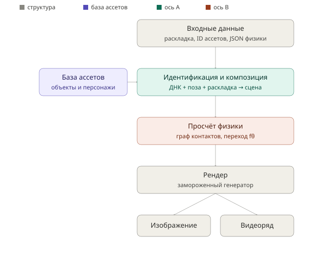
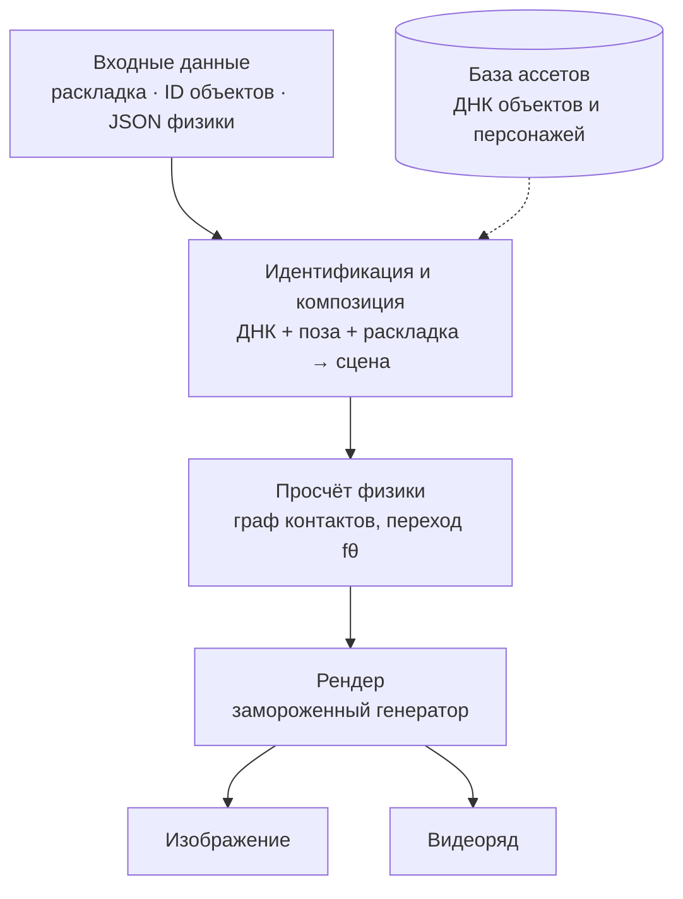

# Целевой пайплайн World-Gen: поток данных и рантайм

Как система на самом деле собирается и исполняется — с правками, внесёнными по
итогам [критического разбора](../research/worldgen-critical-review.md) поверх
исходного предложения в [конвейере World-Gen](worldgen-pipeline.md). Этот документ —
runtime-срез: что откуда приходит, что где хранится, что уходит на выход. Пошаговый
путь к каждому блоку — в [detailed-implementation-plan.md](detailed-implementation-plan.md).

## Поток данных целиком

На входе — сцена как структура, а не пиксели: JSON-раскладка (кто где, чья
камера), список объектных ID со ссылкой на их ДНК в библиотеке-ассетов или на
референсные фото/текст для новых объектов, и опционально JSON физики (масса,
трение, начальные скорости, температура). Часть данных не приходит извне на
каждый запуск, а достаётся из заранее собранной базы: ДНК уже известных объектов
и персонажей лежит в retrieval-индексе (`FAISS`, ID → вектор) и подтягивается по
ссылке, а не пересчитывается заново. Дальше это раскладывается по блокам:
идентичность и композиция каждого объекта в сцене → просчёт взаимодействий →
рендер. На выходе — либо один кадр (фото), либо последовательность кадров с
прокатанным состоянием (видео); вместе с картинкой можно отдать и «слепок»
сцены — актуальные позы, контакты, повреждения объектов на конец ролика, чтобы
продолжить симуляцию дальше без повторного рендера с нуля.

## Восстановление объекта из ДНК в нужной позе

ДНК — это не картинка и не 3D-меш, а компактный код фиксированного размера
(`N` токенов), который несёт «кто это» отдельно от «как он сейчас
повёрнут/согнут». Поза, скелет и физические свойства (жёсткость, масса,
материал) передаются отдельным каналом — вектором скелетных точек и
JSON-атрибутов, который не смешивается с ДНК, а подаётся рядом как условие.
Рендерер (или мостовой 3D-построитель — [фаза 3](detailed-implementation-plan.md#фаза-3--персистентное-3dнативное-состояние-мост-фото--видео),
если нужен кросс-ракурсный кадр) берёт связку `{ДНК, поза, раскладка, камера}` и
через инъекцию в замороженный генератор (K/V/out кросс-внимания) рисует объект —
та же ДНК с другой позой даёт того же персонажа в другом состоянии, а не нового
человека. Для нового ассета без обучения — просто вписать его ДНК в
retrieval-индекс и подать по ID.

## Просчёт взаимодействий объектов

Это не рисуется генератором «на глаз» — это отдельный детерминированный шаг
между идентичностью и рендером. Сцена собирается как граф: узлы — объектные
латенты с физическими атрибутами (масса, жёсткость, трение), рёбра — контакты и
связи между ними. По этому графу латентный переход `fθ` (обученный как дистиллят
настоящего физического солвера, а не набор вручную прописанных правил — в
отличие от исходного «Этапа 2.5» в [конвейере World-Gen](worldgen-pipeline.md#3-слой-логики-взаимодействия-этап-25--ядро-физической-симуляции))
на каждом шаге предсказывает новое состояние — как объекты сдвинулись, что во
что уткнулось, где накопилось давление или деформация. Для рутинных контактов
это быстро и достаточно правдоподобно; для физически критичных моментов
(разрушение, точный удар) состояние на этом кадре точечно пересчитывает
настоящий солвер, а `fθ` и рендер просто «одевают» его результат в пиксели —
подробнее в [фазе 4](detailed-implementation-plan.md#фаза-4--латентный-физдвижок-динамика-видео)
и [фазе 5](detailed-implementation-plan.md#фаза-5--интеграция-полный-нейродвижок-фото--видео).

## Хранение и обработка

Всё, что живёт дольше одного кадра, — это структурированное состояние, а не
пиксели: библиотека ДНК-ассетов (`FAISS`-индекс, ID → вектор), граф сцены с
текущими позами/контактами/физическими атрибутами и история его эволюции по
времени (нужна для видео и для того, чтобы «поставить сцену на паузу» и
вернуться к ней). Рендер — это проекция состояния наружу, выполняемая по
требованию, а не то, что хранится как источник истины. Служебная часть —
воспроизводимость и версии: конфиг прогона и метрики в `MLflow`, датасеты/веса в
`DVC`, золотой набор для регресс-проверки, чтобы изменение в одном блоке
(например, в `fθ`) не тихо не сломало консистентность, полученную в блоке ДНК.

## Входные и выходные данные

| | Что |
| --- | --- |
| **Вход (обязательно)** | JSON-раскладка сцены (объекты, камера); список объектных ID |
| **Вход (по ситуации)** | ДНК новых объектов из референсных фото/текста, если объекта ещё нет в базе; JSON физики (масса, трение, начальные скорости, температура) |
| **Вход (из базы, не с запросом)** | ДНК известных объектов/персонажей — retrieval по ID из `FAISS`-индекса |
| **Выход (обязательно)** | Изображение (фото-режим) или последовательность кадров (видео-режим) |
| **Выход (опционально)** | Слепок состояния сцены на конец прогона (позы, контакты, повреждения) — для продолжения симуляции без пере-рендера |

## Соглашения

- Этот документ описывает **целевой** (скорректированный) пайплайн — предложение
  без правок из [worldgen-pipeline.md](worldgen-pipeline.md) остаётся как
  provenance-артефакт, менять его не нужно.
- Значимые отклонения от этого описания фиксировать как [ADR](../architects/adr/).
