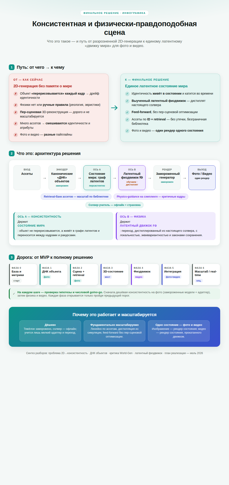
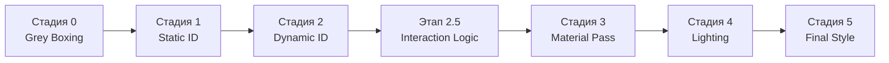

# Сводный документ: Обеспечение консистентности объектов и симуляции взаимодействий в нейросетевом движке «World-Gen»

Ниже суммированы ключевые архитектурные решения, направленные на решение двух центральных задач:

- **консистентность объектов и персонажей** (сохранение идентичности во всех кадрах и ракурсах);
- **реалистичное/управляемое взаимодействие объектов** (столкновения, деформации, фазовые переходы, разрушения).

Документ объединяет материалы из спецификаций конвейера, описания слоя логики взаимодействия (Этап 2.5) и схемы пайплайна, представленной на изображении.

---

## 1. Общая архитектура конвейера «World-Gen»

Конвейер представляет собой модульную последовательность стадий, передающих структурированные данные через **общую шину латентных представлений** (`Shared Embedding Space`). Каждый объект получает уникальный идентификатор (`ID`), что позволяет адресно управлять его геометрией, материалом, физикой и связями.

| Стадия | Название | Роль | Вход → Выход (в шину) |
|--------|----------|------|------------------------|
| 0 | **Grey Boxing** | Задание сцены и камеры | JSON (камера, FOV, боксы) → карты глубины, нормалей, FOV |
| 1 | **Static ID** | Паспортизация статических объектов | Референсные изображения/текстовые ID → латентные векторы идентичности (`DINOv3`) |
| 2 | **Dynamic ID** | Паспортизация динамических объектов | Скелетные точки, данные физики → латентные ID персонажей с учётом позы |
| **2.5** | **Interaction Logic** | **Логика контактов и реология материалов** | Геометрия 0–2 + JSON физики → **Unified Interaction Tensor (`UIT`)**, карты давления, векторы деформации |
| 3 | **Material Pass** | Текстурирование с учётом деформаций | UIT + текстурные промпты → текстурированные объекты (латентное представление) |
| 4 | **Lighting** | Глобальное освещение и тени | UIT + карты глубины → физически корректные тени, AO, рефлексы |
| 5 (6) | **Final Style** | Стилизация и пост-обработка | Стилевой промпт + результаты всех стадий → финальный кадр (`Gaussian Splatting`) |

*Примечание: в схеме Gemini стадии 1–2 объединены в «Identity», а стадии 3–5 сдвинуты на 4–6; суть от этого не меняется.*

---

## 2. Механизмы обеспечения консистентности объектов и персонажей

### 2.1. Семантический якорь DINOv3 и паспорт объекта

**Технология:** `DINOv3` извлекает **плотные признаки (patch-level features)**, устойчивые к изменению ракурса и освещения. На их основе формируется **Object Passport** – уникальный латентный вектор идентичности для каждого `ID`.

- **Gram Anchoring** стабилизирует корреляции между частями объекта, гарантируя, что в кадре №100 «тот же самый» объект будет распознан и отображён без дрейфа признаков.
- На стадиях 1–2 паспорт генерируется по мультиракурсным референсам и/или текстовому `ID` и передаётся в шину для всех последующих этапов.

### 2.2. Жёсткая привязка (Hard Binding) и топология связей

Консистентность взаимодействия персонажа с предметами обеспечивается на этапе 2.5 через **Connection Topology**:

- **Hard Binding** – объект (например, стакан) жёстко связывается с костью персонажа (`ID_рука`). Латентные векторы объединяются в `UIT`; даже если модель-рендерер склонна к галлюцинациям, связь принудительно удерживает объект в координатах руки.
- **Adhesive Link, Kinematic Chain** – сохраняют логику крепления (ткань, волосы, верёвки) без разрыва, передавая в шину векторы натяжения и маски растяжения.

### 2.3. Идентификация по ID на всех стадиях

Благодаря сквозному `ID`:

- На этапе 3 можно заменить материал камня на «жидкое золото», не затрагивая геометрию (`ID` остаётся тем же).
- На этапе 4 освещение пересчитывается с учётом тех же `ID`, тени остаются согласованными.
- Редактор может «заморозить» всю сцену, выставив глобальный коэффициент деформации `Dᵏ = 0`, или изменить тип связи между двумя объектами, просто изменив их запись в тензоре взаимодействия.

---

## 3. Слой логики взаимодействия (Этап 2.5) – ядро физической симуляции

Этот слой – детерминированный «мозг», который вычисляет, как объекты реагируют на контакты, до начала визуализации. Он работает как цензор целостности и генератор управляющих карт.

### 3.1. Входные данные

- Геометрия и маски с `ID` из стадий 0–2 (карты глубины, нормалей, позы).
- **JSON-промпт физики**, содержащий параметры материалов и связей (масса M, трение μ, упругость e, температура T, реологический коэффициент `Dᵏ`, пороги прочности).

### 3.2. Реологическая матрица материалов (Dᵏ)

Каждому `ID` присваивается уровень деформируемости:

| Уровень | Dᵏ | Поведение | Примеры |
|---------|-----|-----------|---------|
| 0: Абсолютная твёрдость | 0 | Нет деформации, только импульс при столкновении | Бетон, сталь |
| 1: Пластическая деформация | 0.1‑0.3 | Накапливает повреждения, активирует слой деструкции | Дерево, пластик |
| 2: Эластичность | 0.4‑0.8 | Генерация Displacement Map для вмятин/растяжений | Плоть, ткань |
| 3: Аморфная среда | 1.0 | Объёмное взаимодействие, плавучесть, сила Архимеда | Вода, газ |

### 3.3. Протокол типов связей (Connection Topology)

Определяет поведение пары `ID_A`–`ID_B` при контакте:

1. **Hard Binding** – жёсткая сцепка, полная передача координат.
2. **Support & Friction** – опорное трение; генерирует Pressure Map для складок, сжатия подошв.
3. **Kinematic Chain** – гибкая цепь; векторы натяжения для волос, кабелей.
4. **Adhesive Link** – вязкое сцепление; сопротивление разрыву, «маска тянучки» для грязи, жвачки.
5. **Field Interaction** – бесконтактное воздействие (магнетизм, ветер, ауры).
6. **Ghosting (Surreal Penetration)** – прохождение сквозь объекты с расчётом искажений света.

### 3.4. Физические переменные в шине

- **Масса (M)** – определяет инерцию и силу столкновения.
- **Трение (μ)** – коэффициент скольжения.
- **Упругость (e)** – коэффициент восстановления (отскок).
- **Температурный вектор (T)** – триггер фазовых переходов: при изменении T объект (лёд, `ID_30`) мгновенно меняет `Dᵏ` (с 0 на 1.0) и тип связи (с Support на Buoyancy); все зависимые объекты пересчитывают векторы движения до рендера воды.

### 3.5. Механика деструкции

Если импульс P = M·V превышает предел прочности материала (заданный через `Dᵏ`):

- Исходный `ID` (например, `ID_Стена`) удаляется, вместо него в шину порождается массив **Sub-ID** (`Sub-ID_Кирпич_1…N`).
- Генерируется **Fracture Map** (маска разлома), адаптированная под тип материала: кристаллический излом для камня, волокнистый для дерева.
- Соседним объектам передаётся «вектор вибрации», влияющий на их позу или смещение.

### 3.6. Выходные данные Этапа 2.5 (передаются в шину)

- **Unified Interaction Tensor (`UIT`)** – компактное представление всех связей, сил и состояний.
- **Pressure Map** – распределение давления в области контакта.
- **Displacement Map** – векторы смещения поверхности для эластичных материалов.
- **Fracture Map + Sub-ID** – информация о разрушении.
- Обновлённые векторы поз и скоростей динамических объектов.

Эти карты напрямую подаются на этапы 3 (для текстурирования деформаций), 4 (для теней с учётом новых геометрий) и 5 (для финальной стилизации).

---

## 4. Сквозной пример: консистентное взаимодействие персонажа с окружением

1. **Загрузка сцены (Стадия 0):** Камера задана, получены карты глубины.
2. **Идентификация (Стадии 1–2):** Персонаж получает паспорт `ID_01`, песчаная поверхность – `ID_02` с `Dᵏ=0.6` (песок).
3. **Логика контакта (Стадия 2.5):**
   - `DINOv3` обнаруживает пересечение паттернов стопы и песка.
   - Для пары (`ID_01`, `ID_02`) задана связь Support & Friction.
   - Система вычисляет Pressure Map и Displacement Map: нога погружается в рыхлую массу.
4. **Визуализация (Стадии 3–5):**
   - `FLUX.2` (Стадия 3) по Displacement Map рисует не просто ногу на плоскости, а реалистичное погружение стопы в песок.
   - Освещение (Стадия 4) добавляет тени в углублениях.
   - Финальный стиль (Стадия 5) сохраняет идентичность персонажа и песка.

Если в JSON-промпте пользователь изменит температуру T для `ID_02`, лёд (`Dᵏ=0`) станет водой (`Dᵏ=1.0`), связь сменится на Buoyancy, и на этапе 2.5 будет пересчитано движение персонажа вниз, ещё до того, как `FLUX.2` начнёт рисовать воду.

---

## 5. Ключевые итоги для консистентности и взаимодействий

- **Консистентность** достигается за счёт сквозных `ID`, паспортизации через `DINOv3` (Gram Anchoring) и жёстких/эластичных связей в `UIT`.
- **Взаимодействие** полностью детерминировано на этапе 2.5: реологическая матрица, типы связей и физические переменные генерируют управляющие карты, направляющие генеративные модели.
- **Входные данные** для подсистемы консистентности и взаимодействий: мультиракурсные референсы, скелетные точки, текстовые `ID`, JSON с физическими параметрами.
- **Выходные данные** этапа 2.5: `UIT`, карты давления, смещения, разломов и массивы Sub-ID – всё это используется для безгаллюциногенного, физически обоснованного рендеринга.

Таким образом, конвейер «World-Gen» превращает генеративный ИИ из «рисовальщика картинок» в управляемую симуляцию материи, где каждый пиксель знает, является ли он твёрдым бетоном, растягивающейся грязью или тающей льдиной.

---
> Источник: [`sources/worldgen-consolidated.pdf`](sources/worldgen-consolidated.pdf) — «Сводный документ: Обеспечение консистентности объектов и симуляции взаимодействий в нейросетевом движке World-Gen».
