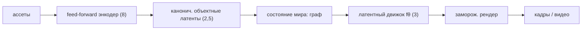

# Латентный физдвижок: переизобрести симуляцию

> **Статус: отложен.** Разбор остаётся корректным, но физика выведена из
> обязательного пути: она дорога и отвечает за другую ось, а для продукта с
> изображениями «упал» — это поза, «разрушен» — вариант ассета. См.
> [Roadmap 17.2](../base-plans/Roadmap.md#172-физика--самый-дорогой-компонент-не-решающий-нашу-задачу).

_Дизайн-пространство · латентная физика · масштабируемая консистентность · 2026_

Не кодировать физику руками (World-Gen 2.5) и не тащить классический солвер в инференс (PSIVG) — а **дистиллировать** солвер в быстрый латентный «интегратор». Плюс меню дешёвых, но фундаментально масштабируемых решений консистентности при множестве ассетов.

*Схема: офлайн-солвер (учитель) → дистилляция → латентный шаг `fθ` с рекуррентностью (t+1) → кадр.*

## Ядро идеи в одном экране

| | |
|---|---|
| **Приём** | Классический движок = {состояние, интегратор, связи, материалы, калибровка}. Каждый компонент пересобираем в латентной/обученной форме, а сам солвер (классический или дифференцируемый) становится **офлайн-учителем**, которого дистиллируем в быстрый латентный шаг. На инференсе — никакого классического солвера, только обученный переход. |
| **Консистентность** | Персистентное объектно-центричное **состояние мира** прокатывается движком во времени. Идентичность держится структурно — объект не «перерисовывается» каждый кадр, а живёт в состоянии. |
| **Почему дёшево + масштабируемо** | Энкодер/декодер заморожены, переход мал; обучение — дистилляцией из симуляции; индуктивные смещения (локальность, эквивариантность, законы сохранения) дают дата-эффективность и обобщение; латент = дёшево по вычислениям; линейно по числу ассетов. |
| **Не спекуляция** | Куски уже показаны: **V-JEPA 2** и **DINO-WM** (предсказание в латенте), **GNS/MeshGraphNets** (обученные симуляторы), **PhysGaussian** (физика на 3DGS), латентные физ-солверы, **Genesis** (быстрый дифф-солвер как учитель). |

## 01 · Переизобретение: движок, разобранный на латенты

_Ты не выбрасываешь физику — ты дистиллируешь солвер в быстрый, дифференцируемый, латентный, генеративно-рендерящийся движок._

| Компонент движка | Классически | Нейро-переизобретение (латентно) | Реальный ориентир |
|---|---|---|---|
| Состояние | меши / частицы / сетки | объектный латент + граф / поле признаков | DINO-WM, слоты |
| Интегратор (шаг во времени) | численный решатель | обученный переход `fθ` (нейро-шаг) | GNS, латентные солверы |
| Столкновения / связи | решатель ограничений | реляционное внимание / message passing | MeshGraphNets |
| Материалы | ручные параметры (ср. `Dᵏ`) | латентный код физ-атрибутов на объект | learned embeddings |
| Истина / калибровка | — | дистилляция из солвера (офлайн-учитель) | Genesis, PhysX/UE5 |
| Рендер | растеризатор | заморож. генератор/сплат по латенту | FLUX/DiT, PhysGaussian |

Именно строка «истина/калибровка» снимает главный риск из критики World-Gen (R1): физика становится корректной не из ручных правил, а из **солвера-учителя** — но заплаченного один раз, офлайн. На инференсе остаётся дешёвый латентный шаг, который можно ещё и дифференцировать и рендерить.

## 02 · Как устроен латентный движок

_Три индуктивных смещения превращают «ещё одну сеть» в стабильный масштабируемый симулятор._

**Состояние** — граф: узлы = персистентные объектные латенты (та самая «ДНК»/паспорт), рёбра = отношения, у каждого узла — латентный код физ-атрибутов (масса, жёсткость, трение); для сплошных сред (жидкости, ткань) добавляется латентное поле. **Переход** `fθ(state, controls) → state'` — это и есть движок. **Рендер** декодирует латент в кадр замороженным генератором; динамика отделена от внешнего вида.

Что делает переход дешёвым, стабильным и обобщающим:

| | |
|---|---|
| Локальность / реляционность | взаимодействия попарно-локальны → message passing (GNS) → перенос на новые конфигурации «из коробки» |
| Эквивариантность (сдвиг/поворот) | E(3)-симметрия зашита в сеть → резкий рост дата-эффективности |
| Законы сохранения / Гамильтониан | энергия/импульс сохраняются по построению → устойчивые длинные роллауты, меньше дрейфа |
| Солвер-подобный шаг + pushforward-noise | малый Δt, авторегрессия с обучением на своих ошибках → стабильность рероллаутов |

```python
# === Латентный физдвижок: собрать состояние и катить во времени ===
nodes = [ encode(a) for a in assets ]        # ❄️ DINOv3/ДНК → идентичность объекта
attrs = [ phys_code(a) for a in assets ]     # 🔥 масса, жёсткость, трение (латентный код)
state = Graph(nodes, edges=relations, attrs)  # состояние мира = граф латентов

for t in range(T):                            # прокатываем во времени
    state   = f_theta(state, controls[t])   # 🔥 нейро-шаг = движок (message passing + эквивар.)
    frame_t = render(state)               # ❄️ замороженный генератор «одевает» состояние

# Обучение f_theta — дистилляция из быстрого солвера (Genesis/PhysX), офлайн:
#   L = ‖ f_theta(state_t) − solver_step(state_t) ‖  (+ законы сохранения, + pushforward-noise)
```

Обрати внимание: единственные «тяжёлые» части (энкодер и рендер) заморожены, а солвер работает только офлайн. Обучается один компактный переход — поэтому весь движок дёшев в разработке и быстр на инференсе.

## 03 · Меню: дешёвые, но фундаментально масштабируемые беты

_Восемь ортогональных ставок для консистентности фото/видео при множестве ассетов. Они композируются — не «или/или»._

### 1. Персистентное 3D-нативное состояние

Держим одно 3D-состояние (сплаты/поле), каждый кадр — его рендер; правки и физика меняют состояние, а не пиксели. Консистентность — свойство представления.

> **Дёшево:** feed-forward построение. **Масштаб:** растёт со сценой, не с кадрами. Ориентир: World Labs «Marble», PhysGaussian.

### 2. Объектные латенты + реляционная память

Сцена = набор персистентных латентов по ID + граф отношений. Каждый ассет — один латент; это же субстрат для латентного движка (узлы графа).

> **Дёшево:** заморож. энкодер + мелкая реляц. сеть. **Масштаб:** линейно по числу объектов. Ориентир: слоты, DINO-WM.

### 3. Learned латентный симулятор

Динамика `fθ`, дистиллят солвера (ядро этой страницы). Один движок — много сцен и ассетов, как настоящий engine.

> **Дёшево:** дистилляция из симуляции. **Масштаб:** смещения → обобщение. Ориентир: GNS, латентные солверы, нейрооператоры.

### 4. Retrieval / внешний банк ассетов

Не вшивать каждый ассет в веса, а хранить банк эмбеддингов и **извлекать** + обусловливать при генерации. Всегда тот же якорь → консистентность.

> **Дёшево:** добавить ассет = добавить строку, без обучения. **Масштаб:** безграничная библиотека (RAG для пикселей). Ориентир: IP-Adapter-память.

### 5. Канонические / эквивариантные репрезентации

Учим идентичность в канонической (нормализованной по позе/ракурсу) форме — инвариантность к проекции по построению, а не по удаче.

> **Дёшево:** симметрия = дата-эффективность. **Масштаб:** инвариантность переносится. Ориентир: эквивариантные сети, канонизация.

### 6. JEPA-предсказание в пространстве признаков

Учим мировую модель, предсказывая будущее/другие виды **в латенте признаков**, а не в пикселях. Дёшево ловит динамику и консистентность без стоимости пиксельного предсказания.

> **Дёшево:** self-supervised, без разметки. **Масштаб:** самое дата-масштабируемое (сырое видео). Ориентир: V-JEPA 2, DINO-WM.

### 7. Physics-guidance на сэмплинге

Дифф-физика/дифф-рендер как плагин-ограничение прямо в сэмплинге диффузии: штрафуем непроникновение, несохранение, геом-несогласованность. Без переобучения.

> **Дёшево:** плагин поверх готового генератора. **Масштаб:** работает как корректор/верификатор. Ориентир: differentiable rendering guidance.

### 8. Feed-forward без пер-сценовой оптимизации

Главный убийца масштаба — test-time оптимизация (фиттинг NeRF/3DGS на сцену). Строим состояние за один проход сети.

> **Дёшево:** нет цикла оптимизации. **Масштаб:** построение состояния O(1). Ориентир: LRM, FluSplat, feed-forward splat.

## 04 · Синтез: как это собирается в один стек

_Победная композиция — не один бет, а их конвейер, где каждая часть по отдельности дёшева._



Сбоку и поверх: банк ассетов для retrieval (4), physics-guidance в сэмплинге (7), обучение — во многом self-supervised в пространстве признаков (6).

> **Одной формулой**
>
> Персистентное объектно-центричное **латентное состояние мира**, построенное feed-forward, с каноническими латентами ассетов, прокатываемое обученным латентным физдвижком (дистиллятом солвера) и одеваемое замороженным генератором, с retrieval-памятью на безграничную библиотеку ассетов и опциональной physics-guidance на сэмплинге. Это и есть «нейронный игровой движок», где физика — обученный латентный переход, а мир — устойчивое латентное состояние.

## 05 · Где это ломается — честно

_У латентной физики есть свои грабли; их надо закладывать сразу._

**Дрейф роллаута на длинном горизонте.** Обученные симуляторы копят ошибку (эмпирически показано в «Lost in Latent Space»). **Митигации:** pushforward-noise, PDE-refiner, законы сохранения в архитектуре, периодическая коррекция настоящим солвером.

**Выбор правильного латента.** Где именно динамика становится марковской и простой — в слотах? в частицах? в признаках JEPA? Это главный research-бет и та же нерешённая «шина» из критики World-Gen. **Подход:** начать с объектно-центричного латента + отдельного поля для сплошных сред.

**Корректность ≠ правдоподобие.** Learned-движок не доказуемо корректен. **Страховка:** ограничивать ошибку относительно учителя-солвера и оставлять настоящий солвер для физически-точных/критичных кадров (гибрид, а не или/или).

**OOD и мультиобъектная привязка.** Новые материалы/взаимодействия вне обучающего распределения; утечка атрибутов между объектами при инъекции многих латентов. **Смягчение:** эквивариантность/сохранение для OOD, раскладка + маскированное внимание против утечки.

## 06 · Минимальный эксперимент, который проверит бет

> **За считанные дни, одна GPU**
>
> Взять один класс взаимодействия (падение и обрушение башни из N кубиков либо драпировка ткани). Сгенерировать роллауты **бесплатно и быстро** в Genesis. Дистиллировать небольшой латентный GNS-переход на объектных латентах. Прокатить и измерить: (а) физ-ошибку против отложенных роллаутов солвера; (б) дрейф на длинном горизонте; (в) кросс-ракурс консистентность рендера; (г) обобщение на **новое** число и конфигурацию кубиков, не виданные в обучении. Бейзлайны: ручная реология (World-Gen 2.5) и пиксельная видеомодель. **Гейт:** латентный движок совпадает с солвером в пределах ε при ≥10× скорости и обобщается на новые конфигурации — значит, бет «латентной физики» подтверждён, и он фундаментально масштабируем.

> Латентный физдвижок — правильная «фундаментально масштабируемая» ставка, но фокус в дистилляции настоящего солвера, а не в ручных правилах и не в пиксельном обучении с нуля. Консистентность даёт устойчивое объектно-центричное состояние, а не магия на кадр. И всё дёшево ровно потому, что каждая тяжёлая часть либо заморожена, либо офлайн. Это не мечта — это то, куда уже сходятся V-JEPA, DINO-WM, GNS и PhysGaussian.

## Источники

- [V-JEPA 2 — Meta (мировая модель в латенте)](https://arxiv.org/abs/2506.09985)
- [DINO-WM — world models на замороженных признаках](https://dino-wm.github.io/)
- [Learning to Simulate Complex Physics with Graph Networks (GNS)](https://arxiv.org/abs/2002.09405)
- [MeshGraphNets](https://arxiv.org/abs/2010.03409)
- [PhysGaussian: физика на 3D Gaussians](https://xpandora.github.io/PhysGaussian/)
- [Genesis: генеративный дифф-физдвижок](https://genesis-embodied-ai.github.io/)
- [Lost in Latent Space: латентная эмуляция физики (риски)](https://arxiv.org/html/2507.02608)
- [Fourier Neural Operator](https://zongyi-li.github.io/blog/2020/fourier-pde/)

---
> Источник: [`sources/latent-physics-engine.html`](sources/latent-physics-engine.html) (исходный HTML-артефакт).
