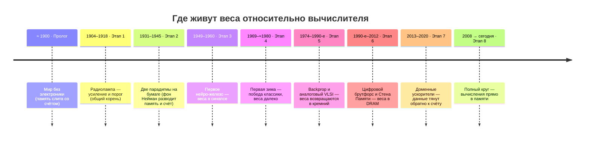

# Плата для нейросетей своими руками

*Гаражный журнал · с нуля · ~1900 → сегодня*

История железа для ИИ как один сюжет — от механических реле до мемристорных кроссбаров, увиденная через одну идею: *веса должны жить там же, где идёт вычисление.*

> Ты задал две рамки, и они оказались двумя сторонами одной монеты.
>
> **Рамка 1 — веса рядом с вычислением.** Это не мелкая оптимизация, а водораздел всей архитектуры. Как только память и вычислитель разъезжаются, появляется «стена памяти»: чип простаивает, гоняя веса туда-сюда по шине.
>
> **Рамка 2 — классика против нейросети.** Два способа взять нелинейную задачу. И именно выбор способа диктует, разъедутся веса с вычислителем или нет. Дальше — вся история как маятник между этими полюсами.
>
> **Рамка 3 — модульность решений.** Реальная система — это не один кристалл, а много одинаковых блоков: тайл → чиплет → плата → стойка. Это даёт масштаб, выход годных и управляемую разработку — но каждая граница между блоками есть маленькое возвращение стены памяти. Модульность диктует всей системе отдельный набор ограничений (отдельный раздел ниже).

## Два способа решить нелинейную задачу

*С этого развилка и начинается всё железо. Держим её в голове, спускаясь по годам.*

Возьмём любую нелинейную задачу — распознать цифру, предсказать траекторию, отделить «да» от «нет», когда граница кривая. Есть ровно два пути, и они расходятся до самого кремния.

**Классический путь.** Человек *сам* выводит алгоритм и записывает его как инструкции. Универсальная машина (по фон Нейману) достаёт инструкции и данные из общей памяти, прогоняет через один арифметический блок и возвращает результат в память. Нелинейность берётся «руками»: ветвлениями `if`, численными методами, формулами. Машина одна на всё — но данные вечно ездят между памятью и вычислителем.

**Нейросетевой путь.** Ты *не пишешь* алгоритм. Ты собираешь сеть простых узлов, каждый из которых умеет одно: взвешенно сложить входы и пропустить сумму через нелинейную функцию (порог, сигмоида). «Программа» — это набор весов на связях, и он не пишется, а *обучается* на примерах. Нелинейность встроена в каждый узел; сложи слои — и получишь универсальный аппроксиматор любой кривой границы.

А теперь ключевое следствие для железа. Нейросети — это, по сути, одно гигантское умножение матриц: «вектор входов × матрица весов». Если веса лежат в далёкой памяти, ты обречён их бесконечно подвозить. Если же веса физически сидят в точке умножения — вычисление происходит *там, где они лежат*, и подвозить нечего. Поэтому «настоящее» нейросетевое железо всегда тянется обратно к аналоговому синапсу, а классическое — к фон-неймановскому разделению.

| Вопрос | Классическое программирование | Нейросетевой подход |
| --- | --- | --- |
| Кто находит решение | человек пишет алгоритм | сеть учится на примерах |
| Где «программа» | инструкции в памяти | веса связей |
| Откуда нелинейность | явная математика, ветвления | функция активации в каждом узле + слои |
| Железо тяготеет к… | фон Нейман: память ≠ вычислитель | веса внутри вычислителя |
| Узкое место | стена памяти (шина) | шум и точность аналоговой ячейки |

## Вся история — поэтапно

*У каждой эпохи смотрим три вещи: наука, железо и — где в этот момент живут веса относительно вычислителя. Плюс гаражная сноска: что реально спаять на верстаке той поры.*

Обозначения расположения весов: **веса в вычислителе** (рядом со счётом) · **веса далеко от вычислителя** · **общий корень / компромисс**.

### ≈ 1900 · Пролог — Мир без электроники

*Расположение весов: у аналоговой машины «память» и «счёт» всегда слиты.*

На верстаке 1900 года нет ни транзистора, ни цифрового компьютера. Есть шестерни, рычаги, батареи, электромагниты и телеграфные реле. Булева алгебра существует на бумаге (Буль, 1854), но не в железе. Вычисление бывает двух сортов: *механико-классическое* (арифмометр крутит числа) и *физико-аналоговое* — машина, чья физика *сама есть* уравнение. Приливная машина Кельвина складывает синусоиды шестернями; в ней «параметр» (амплитуда гармоники) задан размером колеса — то есть память слита с вычислением. Это первый намёк на всю нашу тему.

Теги: `реле и электромагниты` · `аналоговая механика` · `нейрона ещё нет как понятия`

**В гараже:** максимум — релейная логическая схемка или механический сумматор на резисторах и гальванометре. Усиливать сигнал ещё нечем — и это главный тормоз.

### 1904 – 1918 · Этап 1 — Радиолампа: появляются усиление и порог

*Расположение весов: общий корень обеих ветвей.*

Диод Флеминга (1904) и триод Де Фореста (1906) впервые дают *усиливать* и *переключать* электрический сигнал. Это разом предпосылка и для цифровой логики, и для аналоговых нейро-схем: лампа умеет и щёлкать как ключ, и работать нелинейным пороговым элементом. В 1918-м Экклз и Джордан собирают триггер — первую электронную ячейку памяти. Ветвь ещё одна, но из неё уже растут обе будущие.

Теги: `триод — усиление` · `триггер — память` · `нелинейный порог «даром»`

**В гараже:** ламповый усилитель, генератор, а к концу этапа — триггер. Уже можно построить ламповый «нейрон»: сумма на резисторах + лампа как порог.

### 1931 – 1945 · Этап 2 — Две парадигмы рождаются на бумаге

*Расположение весов: фон Нейман узаконивает разрыв памяти и счёта.*

**Классическая ветвь.** Тьюринг (1936) описывает универсальную машину; Шеннон (1937) показывает, что булеву алгебру можно собрать из реле — рождается цифровая схемотехника; аналоговый дифференциальный анализатор Буша (1931) решает нелинейные дифуравнения физическим интегрированием. В 1945-м отчёт фон Неймана по EDVAC закрепляет архитектуру с общей памятью для программы и данных. Для обычных задач — гениально. Для будущих нейросетей — *первородный грех*: память и вычислитель разведены, и через полвека это станет стеной памяти.

**Нейронная ветвь.** Маккаллок и Питтс (1943) дают первую математическую модель нейрона — пороговый логический элемент — и показывают, что сети таких узлов вычисляют логические функции. Понятие «нейрон в железе» родилось.

Теги: `Тьюринг · Шеннон` · `фон-неймановская архитектура` · `нейрон Маккаллока–Питтса`

**В гараже:** релейный или ламповый сумматор-с-порогом — физический нейрон Маккаллока–Питтса. Веса пока «зашиты» номиналами резисторов вручную.

### 1949 – 1960 · Этап 3 — Первое нейро-железо — и веса живут прямо в синапсе

*Расположение весов: каждый вес — физическая деталь в точке связи.*

Это золотой век твоей идеи. Хебб (1949) формулирует правило обучения: связь усиливается, когда узлы активны вместе. И дальше веса начинают *материализоваться*.

**SNARC** (Минский и Эдмондс, 1951) — первая нейросетевая машина: ~40 синапсов, 300 радиоламп, моторы, электромагнитные муфты и конденсаторы; вес каждого синапса хранится как заряд на конденсаторе и положение муфты — прямо в синапсе. Училась подкреплением, размером с рояль, собрана в т.ч. из автопилота бомбардировщика B-24.

**Перцептрон Mark I** (Розенблатт, публичная демонстрация 23 июня 1960) — 400 фотоэлементов сеткой 20×20 («сетчатка»), 512 ассоциативных узлов, 8 выходов. Веса хранятся в *потенциометрах*, а при обучении их крутят *электромоторы*. Вес — это буквально угол ручки в узле связи.

**ADALINE / мемистор** (Уидроу и Хофф, 1960). Мемистор — электрохимическая ячейка: её проводимость (от 100 до 1 Ом) задаётся интегралом протёкшего тока, то есть *вес хранится как проводимость там же, где идёт умножение*. Это, по сути, мемристор за 11 лет до теории и прямой предок современного кроссбара.

Теги: `Хебб · обучение` · `потенциометры + моторы` · `мемистор = вес как проводимость`

**В гараже:** самый «собираемый» нейрокомпьютер за всю историю. Фотоэлементы, горсть потенциометров (веса), сумма токов на операционнике, компаратор (порог) — рабочий перцептрон на макетке. Именно с этого мы и стартуем ниже.

### 1969 – ≈1980 · Этап 4 — Первая зима: спотыкаемся о нелинейность

*Расположение весов: победа классики → всё уходит в фон-неймановские машины.*

Минский и Паперт в книге «Perceptrons» (1969) доказывают: однослойный перцептрон не может решить XOR — задачу, где классы нельзя разделить прямой. Нужны скрытые слои с нелинейностью, но учить их ещё не умеют. Финансирование пересыхает — первая «зима ИИ». На авансцену выходит классическая, символьная ветвь: экспертные системы решают задачи явными правилами на обычных цифровых машинах. Развилка «классика против нейросети» из абзаца в начале — вот она, в виде реального исторического поворота, и в 70-е выигрывает классика.

Теги: `проблема XOR` · `нужны скрытые слои` · `символьный ИИ / экспертные системы`

**В гараже:** эпоха микропроцессора (Intel 4004, 1971). Проще купить готовый цифровой чип и писать *алгоритмы*, чем паять аналоговые синапсы. Веса-в-железе временно забыты.

### 1974 – 1990-е · Этап 5 — Обратное распространение и аналоговый VLSI-ренессанс

*Расположение весов: веса возвращаются в кремний — как заряд на затворе.*

**Ключ к нелинейности найден.** Метод обратного распространения (Вербос, 1974; прославлен Румельхартом, Хинтоном и Уильямсом, 1986) позволяет обучать многослойные сети — и XOR, и куда более сложные кривые границы становятся по зубам. Сеть Хопфилда (1982) и неокогнитрон Фукусимы (1980) возвращают интерес; ЛеКун собирает LeNet — свёрточную сеть для распознавания цифр (1989).

**И снова веса в вычислителе.** Карвер Мид создаёт нейроморфную инженерию и книгу «Analog VLSI and Neural Systems» (1989): аналоговый кремний, где память и счёт совмещены, как в биологии, и всё это ест микроватты. Intel выпускает **ETANN 80170NX** (1989) — 64 аналоговых нейрона и 10 240 синапсов на *плавающих затворах*: вес хранится как заряд прямо в синапсе, умножение делает аналоговый перемножитель Гилберта, а суммирование — просто общий провод (закон Кирхгофа). Скорость — 2 млрд соединений в секунду, без единого обращения к внешней памяти.

Теги: `backprop учит слои` · `Карвер Мид · нейроморфика` · `ETANN: веса на плавающем затворе`

**В гараже:** аналоговый VLSI не спаяешь, но принцип — да: op-amp'ы, аналоговые перемножители, конденсаторы/цифровые потенциометры как веса. Малый аналоговый синапс собирается на столе.

### 1990-е – 2012 · Этап 6 — Цифровой брутфорс и Стена Памяти

*Расположение весов: веса в DRAM — максимально далеко от АЛУ.*

Пока нейросети переживают вторую зиму, закон Мура делает *цифровые* фон-неймановские машины бешено быстрыми и дешёвыми. Прагматика побеждает: нейросеть проще гонять как софт — перемножение матриц — на обычном цифровом железе. Веса переезжают в DRAM, далеко от арифметики. Именно тогда Вульф и Макки формулируют «стену памяти» (1994): разрыв между быстрым счётом и медленной памятью растёт и становится главным тормозом. Ирония в чистом виде — нейросети крутят на архитектуре, которая для них худшая.

Спасение приходит сбоку: видеокарты. GPU массово-параллельны и рождены перемножать матрицы; с CUDA (2006–2007) их можно программировать не только для графики. В 2006-м Хинтон переобувает «глубокие сети» в бренд *deep learning*, а в 2012-м AlexNet на двух GPU разносит ImageNet — и всё взрывается.

Теги: `закон Мура` · `стена памяти (1994)` · `GPU + CUDA` · `AlexNet, 2012`

**В гараже:** покупаешь видеокарту и пишешь на CUDA. Порог входа — минимальный, эффективность на ватт — так себе: ты платишь за подвоз весов.

### 2013 – 2020 · Этап 7 — Доменные ускорители: тянем данные обратно к счёту

*Расположение весов: компромисс — большой SRAM/HBM держит веса рядом (но ещё в цифре).*

Раз стена памяти — главный враг, чипы начинают проектировать *вокруг* неё. Google TPU (внутри с ~2015, статья 2017) — это большой систолический массив умножителей с крупной памятью SRAM прямо на кристалле: данные текут сквозь решётку, максимально переиспользуются и почти не ездят наружу. Память HBM (стек прямо на корпусе, ~2013) подтаскивает DRAM физически ближе. Дальше — кембрийский взрыв: Cerebras (процессор во всю пластину, гигантский on-chip SRAM), Graphcore, Groq, нейродвижки в телефонах. Общий мотив один — держи данные ближе к счёту.

Теги: `систолический массив (TPU)` · `HBM ближе к чипу` · `Cerebras · Graphcore · NPU`

**В гараже:** здесь появляется твой инструмент — FPGA. На ней можно собрать маленький систолический массив (по сути «TPU на коленке») и своими глазами увидеть борьбу со стеной памяти в цифре.

### 2008 → сегодня · Этап 8 — Полный круг: вычисления прямо в памяти

*Расположение весов: вес = проводимость ячейки; умножение идёт в ней самой.*

Чуа ещё в 1971-м предсказал «мемристор» — недостающий четвёртый элемент цепи, связывающий заряд и поток. В 2008-м HP делает его физически (плёнка TiO₂). И тут всё сходится.

Мемристорный (или ReRAM/PCM) **кроссбар**: в каждой точке пересечения — ячейка, чья проводимость *и есть* вес. Подаёшь входы напряжениями на строки. По закону Ома ток в ячейке = напряжение × проводимость — это умножение. По закону Кирхгофа токи на столбце складываются сами собой — это накопление. Всё перемножение «вектор × матрица» происходит *за один физический шаг там, где лежат веса*, почти без движения данных. Это и есть предел твоей идеи — и это буквально воскресший мемистор Уидроу 1960 года, только в нанометрах. В железе это уже везде: Mythic (аналоговый счёт на флеш-памяти), аналоговый ИИ у IBM (фазовая память), десятки исследовательских ReRAM-ускорителей, плюс compute-in-memory на обычном SRAM.

Теги: `мемристор: Чуа 1971 → HP 2008` · `Ом = умножение, Кирхгоф = сумма` · `Mythic · IBM analog AI`

**В гараже:** кроссбар из потенциометров/резисторов на макетке — это работающая демонстрация ровно этого принципа. Мы соберём её следующей.

> **Дуга целиком, в одном предложении**
>
> Первые нейромашины (перцептрон, ADALINE) хранили веса *физически в синапсе*, в аналоге, — потому что так естественно. Фон Нейман развёл память и счёт и подарил нам полвека цифрового прогресса, но и стену памяти. А сейчас мы возвращаемся к весам-в-точке-умножения — теперь в наноприборах. Твой инстинкт «держать веса у вычислителя» — это и есть вся эта дуга, свёрнутая в одну мысль.

## Модульность: собрать систему из блоков — и её цена

*Один огромный кроссбар держал бы все веса локально — идеал твоей рамки. Но его нельзя ни изготовить, ни отмасштабировать, ни получить с приемлемым выходом годных. Поэтому систему собирают из повторяющихся модулей — и это диктует свои правила.*

Модульность — это когда система строится из одинаковых композируемых блоков, а не как единый монолит, и так на каждом уровне: тайл (фиксированная матрица весов и умножителей, скажем 128×128) → процессорный элемент → чиплет (отдельно изготовленный кристалл в общем корпусе) → плата → стойка. Зачем: повторное использование (спроектировал блок — размножил), масштаб (добавляй тайлы/чиплеты/узлы), выход годных (мелкие кристаллы годятся чаще, брак можно отключить), верификация (проверил один блок) и гибкость раскладки сети по блокам.

> **Главное противоречие**
>
> Модульность прямо спорит с «весами-в-точке-счёта». Идеал — одна гигантская матрица, где всё локально и данные не двигаются. Реальность — такую матрицу не построить: площадь, выход годных, питание, тепло. Модули делают систему собираемой, но *каждый стык между ними — это снова движение данных, снова мини-стена памяти на более высоком уровне*. Поэтому всё искусство системного проектирования: сделать модули настолько большими и самодостаточными, насколько позволяет физика (чтобы веса жили локально внутри блока), а границы между ними — настолько дешёвыми, насколько возможно.

Из этого противоречия и вырастают ограничения, которые модульность накладывает на систему целиком:

- **01 · Межсоединение — новое узкое место.** Как только счёт разрезан на модули, они обязаны общаться. Взвешенная сумма, что внутри тайла шла по проводу «бесплатно», теперь пересекает границу: сеть-на-кристалле, связь чиплетов (die-to-die), шину платы, фабрику стойки. Пропускная способность и задержка стыков, а не пиковый счёт, всё чаще определяют скорость всей системы.
- **02 · Стандартные интерфейсы обязательны.** Блоки соединяются только по общему контракту: фиксированный размер тайла, формат чисел и точность, протокол обмена, домены такта и сброса. Стандарт стоит гибкости — каждый модуль платит за интерфейс «по нижней планке» и не может оптимизировать его в одиночку.
- **03 · Фиксированная гранулярность → фрагментация.** Тайл имеет жёсткий размер. Слои сети под него не подгоняются: слой 100×100 не заполняет матрицу 128×128, а слой шириной 130 требует второй тайл и тратит почти весь. Компилятор режет сеть под сетку модулей, и каждая нестыковка — это простаивающий кремний.
- **04 · Компилятор становится сердцем системы.** С модулями надо решать, что куда положить и как связать: размещение слоёв по тайлам, маршрутизацию активаций, балансировку нагрузки, планирование, минимизацию обмена. Это тяжёлая оптимизация — модульность перекладывает сложность из железа в софт, и стек компилятора важен не меньше самого чипа.
- **05 · Синхронизация и буферизация.** Модули работают полу-независимо; чтобы их сложить, нужны синхронизация (глобальный такт против GALS — «глобально асинхронно, локально синхронно»), буферы, управление потоком и обратное давление. Закрытие тайминга через границы — особенно чиплетов и плат — ограничивает частоты.
- **06 · Питание и тепло — по каждому модулю.** Каждый блок надо накормить током и охладить; сумма из сотен тайлов и чиплетов даёт плотность мощности и горячие точки. Сеть питания (PDN) обязана раздать сотни ампер на все модули разом — это ограничение уровня всей платы и корпуса, а не отдельной ячейки.
- **07 · Аналог плохо стыкуется: АЦП на каждой границе.** Для нашего аналогового пути это жёстко. У каждого кроссбара свой шум, смещение и разброс приборов, а чтобы соединить тайлы, на краю каждого нужен переход аналог→цифра. АЦП/ЦАП съедают львиную долю площади и энергии и ограничивают, каким большим может быть тайл, пока шум и падение напряжения не убьют точность. Мечта «веса на месте» масштабируется ровно до размера одного аналогового модуля — дальше платишь оцифровкой на шве.
- **08 · Отказоустойчивость как условие.** Плюс модульности — бракованный тайл можно отключить (спасение для выхода годных). Но за это архитектура обязана терпеть отсутствующие и переназначенные блоки: запасные тайлы, логика ремаппинга, адресация, не полагающаяся на «все модули на месте». Систему приходится проектировать под деградацию без обвала.

История дала два противоположных ответа на этот вызов, и оба — про одно и то же ограничение, про то, где провести шов и сколько он стоит. **Cerebras** делает модуль огромным — процессор во всю кремниевую пластину, лишь бы вообще не пересекать границы чипов. **Чиплеты** (AMD и другие) — ставка наоборот: пусть блоки мелкие, зато граница между ними максимально дешёвая за счёт продвинутой упаковки и стандартов связи die-to-die. Выбор шва — и есть выбор архитектуры.

В гаражной лестнице ниже это ограничение поджидает тебя на ступени 3: пока систолический массив помещается в один блок SRAM — всё локально; как только перестаёт — ты лбом встречаешь ровно эти стыки, и дальше проектируешь уже не тайл, а систему из тайлов.

## Собираем в гараже — сегодня, с нуля

*Не повторяем ошибку «сразу заказать кремний». Идём по лестнице, где каждая ступень воспроизводит свою эпоху и добавляет ровно одну идею.*

Сердце всего — **аналоговый перемножитель «вектор × матрица» на кроссбаре**. Он же — перцептрон Розенблатта, он же — принцип мемристорного чипа. Собирается из деталей, доступных ещё в 1960-х:

> **Ядро: аналоговый кроссбар на потенциометрах**
>
> **Входы** — напряжения на горизонтальных проводах (строках). **Веса** — проводимость в каждом пересечении: потенциометр (а хочешь ближе к истории — мотор его крутит, как в Mark I; хочешь удобнее — цифровой потенциометр под управлением МК).
>
> **Умножение** делает закон Ома: ток через ячейку = напряжение строки × проводимость. **Сложение** делает закон Кирхгофа: токи на вертикальном проводе (столбце) суммируются сами. Операционник на конце столбца превращает суммарный ток в выходное напряжение — это готовый скалярный продукт, то есть строка матрицы весов, умноженная на вход.
>
> **Знак весов** — как в ETANN и современных кроссбарах: пара проводимостей G⁺ и G⁻, их разность даёт минус. **Нелинейность** — компаратор (жёсткий порог, классический перцептрон) или диод/транзистор (мягкая кривая типа сигмоиды/ReLU). Без неё слои схлопнутся в одну прямую — тот самый урок XOR.
>
> **Обучение** — правило Уидроу–Хоффа (LMS): подкручиваешь проводимости в сторону уменьшения ошибки. Руками, мотором или цифровым потенциометром от микроконтроллера.

Физически это и есть мемристорный кроссбар, собранный из деталей эпохи ADALINE: веса лежат ровно в точке умножения, данные никуда не ездят. Дальше — просто наращиваем реализм:

**1. Аналоговый перцептрон на макетке**
Потенциометры-веса + сумма на операционнике + компаратор. Обучи правилу LMS решать линейную задачу, потом добавь скрытый слой и возьми XOR.
*≈ Перцептрон и ADALINE, 1958–1960. Чувствуешь на пальцах: веса = проводимость.*

**2. Микроконтроллер + цифровые потенциометры**
МК подаёт входы, читает выход через АЦП и сам крутит цифровые потенциометры по правилу обучения. Аналоговый счёт — но автоматическое обучение.
*≈ Дух ETANN, 1989: перезаписываемые аналоговые веса в синапсе.*

**3. FPGA — маленький цифровой TPU**
Опиши на Verilog/Chisel систолический массив умножителей-с-накоплением и держи веса в блочном SRAM на кристалле. Здесь ты лбом почувствуешь стену памяти и научишься с ней драться.
*≈ TPU и доменные ускорители, 2015+. Цифра, но данные близко.*

**4. Готовый комплект вычислений-в-памяти**
Отладочные платы на ReRAM/PCM или аналоговом флеше (analog-AI киты) — настоящий современный кроссбар без своей фабрики. Тот же принцип ступени 1, но в нанометрах и всерьёз.
*≈ Mythic, IBM analog AI, 2020-е. Полный круг замкнулся.*

**5. И только теперь — мечтать о своём кремнии**
Свой ASIC/чиплет — это миллионы долларов, годы и tape-out. К нему идут, когда ступени 1–4 уже доказали и архитектуру, и — критично — программный стек (компилятор из PyTorch в твоё железо). Софт решает не меньше кремния: экосистема CUDA — вот что сделало NVIDIA непобедимой.
*≈ Собственно «своя плата для нейросетей». Финал, а не старт.*

> Побеждает не тот, у кого больше вычислителей, а тот, у кого веса не ездят по шине и кого удобно программировать. Стартуй от нагрузки и от весов-в-точке-счёта — кремний закладывай последним.

## Источники

- [Mark I Perceptron — Wikipedia](https://en.wikipedia.org/wiki/Perceptron)
- [Memistor (Widrow) — Wikipedia](https://en.wikipedia.org/wiki/Memistor)
- [SNARC — Wikipedia](https://en.wikipedia.org/wiki/Stochastic_Neural_Analog_Reinforcement_Calculator)
- [Intel ETANN 80170NX — WikiChip](https://en.wikichip.org/wiki/intel/etann)
- [ETANN — Computer History Museum](https://computerhistory.org/blog/neural-network-chip-joins-the-collection/)
- [Neuromorphic computing / Carver Mead — Wikipedia](https://en.wikipedia.org/wiki/Neuromorphic_computing)
- [Memristive in-memory computing — PMC](https://pmc.ncbi.nlm.nih.gov/articles/PMC9756267/)
- [Compute-in-memory: Ohm's & Kirchhoff's laws](https://no-1.pro/research/15-compute-in-memory/)

---
> Источник: [`sources/neuro-hardware-history_1.html`](sources/neuro-hardware-history_1.html) (исходный HTML-артефакт, расширенная версия).
