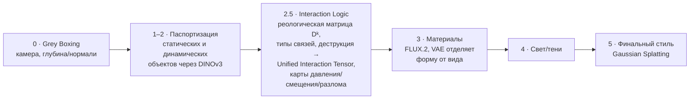

# World-Gen: сильный директор, спорный физик

*Критический разбор · World-Gen × фронтир мировых моделей · 2026*

Модульный «нейронный игровой движок» против трёх ставок фронтира. Где решение выигрывает (консистентность, контроль, дешёвые данные), где рвётся шов (физическая корректность), и что менять ради конечной цели — консистентной физически-правильной сцены.

## Вердикт в одном экране

| | |
|---|---|
| **Что это** | Модульный конвейер-«игровой движок»: DINOv3-«паспорт объекта» для консистентности + детерминированный Этап 2.5 («мозг физики») + рендер FLUX.2, всё через общую латентную шину с ID. |
| **Компоненты реальны** | Проверил: FLUX.2 klein, DINOv3 (Gram Anchoring), FluSplat, Control-DINO, Self-Flow, PSIVG — **всё существует и выбрано грамотно**. Второй документ похож на LLM-сборку (следы схемы Gemini, часть «источников» — твои же промпты), но техстек не выдуман. |
| **Главная сила** | Контролируемость и консистентность через сквозные ID + паспорт; редактируемость (материал/свет по ID); дешёвое обучение synthetic-to-real из UE5. |
| **Главный риск** | **«Детерминированная физика без физдвижка».** Этап 2.5 как ручная реология (Dᵏ 0–3, 6 типов связей) даёт правдоподобие, но не корректность — и не покрывает динамику во времени. Фронтир для корректности **возвращает** реальный солвер (PSIVG) либо учит физику на масштабе (Genie/Cosmos). |
| **Итог** | Отличный **директорский слой и data-engine**, но сам по себе не физически-корректный симулятор. Позиционировать честно, физику решать отдельной осью, консистентность — через 3D-нативное состояние. |

### Оценка по осям

| Ось | Оценка |
|---|---|
| Консистентность (ID/паспорт) | сильно |
| Контролируемость / редактируемость | сильно |
| Дешёвый прототип (LoRA + UE5) | сильно |
| Физическая корректность | риск |
| Путь к real-time «playable» | риск |
| Проработка «шины данных» | пробел |

## 01. Что предложено — коротко и честно

*Реконструирую суть, чтобы критика била по фактам, а не по пересказу.*

World-Gen — это конвейер из стадий, передающих структурированные данные через общую латентную шину, где у каждого объекта есть сквозной ID: `0` Grey Boxing (камера, глубина/нормали) → `1–2` паспортизация статических и динамических объектов через DINOv3 → `2.5` **Interaction Logic** (реологическая матрица `Dᵏ`, типы связей, механика деструкции → Unified Interaction Tensor, карты давления/смещения/разлома) → `3` материалы (FLUX.2, VAE отделяет форму от вида) → `4` свет/тени → `5` финальный стиль (Gaussian Splatting).

*Схема конвейера World-Gen по стадиям:*

Консистентность держится на трёх китах: плотные признаки DINOv3 + Gram Anchoring как «паспорт», жёсткие/эластичные связи в UIT, и сквозная адресация по ID. Обучение — дёшево: synthetic-to-real из UE5/Unity (RGB, глубина, нормали, ID-маски, логи PhysX) + LoRA/ControlNet по стадиям.

## 02. Что здесь по-настоящему сильно

*Это не наивная идея — многое совпадает с реальным трендом «нейронных игровых движков».*

- **Модульная декомпозиция** — Разбиение на геометрию → идентичность → взаимодействие → материал → свет → стиль даёт контроль и интерпретируемость и бьёт по галлюцинациям. Это ровно то направление, куда двигается индустрия против «чёрного ящика».
- **DINOv3-паспорт** — Плотные признаки с Gram Anchoring — верный выбор для идентичности и трекинга. Совпадает с реальными методами (Control-DINO, FluSplat), где признаки DINO — условие для генерации.
- **ID-шина = редактируемость** — Смена материала без геометрии, консистентный пересчёт света по тем же ID, «заморозка» сцены через `Dᵏ=0` — это реальные плюсы структурированного представления над плоской диффузией.
- **Synthetic-to-real из UE5** — Бесплатная идеальная разметка (глубина, нормали, ID, физика из PhysX) — стратегия уровня фронтира: так же кормят себя NVIDIA Cosmos и робо-симуляторы. Дёшево и правильно.

## 03. Слабые места и риски

*По каждому — в чём проблема и как её обходит фронтир.*

### R1 · «Физически корректно» — заявлено, но не решено

Этап 2.5 — это, по сути, вручную закодированный мини-физдвижок: дискретная реология (`Dᵏ` 0–3) и 6 типов связей. Такой набор даёт **правдоподобие и арт-дирекшн**, но не корректность: реальные контакты, трение, разрушение и жидкости несводимы к 4 уровням. И ключевое — **кто считает динамику во времени?** Одиночные карты давления/смещения — это статические подсказки на кадр, а не временная симуляция столкновений и распространения деформации.

> **Фронтир:** для настоящей корректности PSIVG (CVPR 2026) вставляет **реальный** физсимулятор в цикл: черновик → реконструкция 4D-мешей → симуляция траекторий → управление рендером. То есть возвращает тот самый солвер, который ты хотел исключить.

### R2 · «Детерминизм» спорит с генеративностью

Ты хочешь детерминированный 2.5, а рисует стохастический FLUX. Но ControlNet-условие — **мягкое**: оно смещает, а не гарантирует. Непроникновение, сохранение объёма, точные точки контакта из генеративного рендера не гарантируются — «связь принудительно удержит объект» это оптимизм, а не свойство диффузии.

> **Обход:** либо жёсткие ограничения вне генератора (солвер/3D-состояние как источник истины, рендер лишь «одевает»), либо проверяющий цикл, отбраковывающий кадры с нарушением физики.

### R3 · Накопление ошибок в длинном конвейере

6+ обученных стадий, сцепленных через латентную шину: ошибка глубины на стадии 0 течёт вниз, а межстадийные интерфейсы надо делать взаимно-согласованными. Совместная тренировка такой цепочки недооценена — это большая системная работа, которой end-to-end-модели избегают по построению.

> **Смягчение:** сквозное дообучение (end-to-end fine-tune) поверх модульной инициализации; жёсткие «контракты» на интерфейсах шины; ранняя проверка на 2–3 стадиях, а не на всех сразу.

### R4 · «Шина данных» — самое несущее и наименее проработанное

Единое латентное пространство, где сосуществуют текст, геометрия, ID **и** физика (масса, трение, тензоры давления), — это огромная research-проблема сама по себе. CLIP/VLM не кодируют физику; свести всё в один вектор, который каждая стадия читает и пишет когерентно, — гипотеза, а не данность. Именно на ней всё держится.

> **Реалистичнее:** не один магический вектор, а типизированные каналы (гео-карты, ID-маски, физ-тензоры) + общий индекс по ID; сводить в общий эмбеддинг только там, где это доказуемо помогает.

### R5 · «Кадр 1 = кадр 100» переоценено; тайком нужна 3D

DINOv3-паспорт даёт стабильные признаки для **распознавания**, но не гарантирует, что генератор нарисует объект одинаково при большом повороте — это та самая 2D→3D-неоднозначность. Поэтому за настоящей новоракурсной консистентностью документ и тянется к 3DGS/FluSplat — а это уже частичная 3D-реконструкция, что противоречит установке «без полной 3D».

> **Честнее:** признать 3D-нативное состояние объекта (tri-plane / feature-field / компактный сплат) как «структурированную ДНК» — оно и решает кросс-ракурс, и остаётся дешевле полной сцены с физдвижком.

### R6 · Real-time × модульность — в противоречии

Ты ссылаешься на playable-миры (Genie, Oasis) как на цель. Но они **end-to-end** именно ради скорости (Genie 3 — 24 fps 720p одной сетью). Тяжёлый многомодельный конвейер с отдельным физ-проходом и несколькими рендер-стадиями почти наверняка не real-time.

> **Стратегия:** использовать модульный конвейер как **учителя и генератор данных**, а для playable — дистиллировать его в одну быструю студенческую модель (это же есть в твоей идее модульной дистилляции).

### R7 · Провенанс второго документа

Отчёт по FLUX/DINO похож на LLM-сгенерированный (упоминание «схемы Gemini», часть списка источников — твои же промпты, единые даты обращения). Хорошая новость: выборочная проверка показала, что ключевые методы **реальны**. Но конкретные числа (VRAM, метрики, размеры) стоит перепроверять по первоисточникам, а не принимать на веру.

> **Гигиена:** держать отдельный «проверенный» список источников; не закладывать в план ни одного компонента, который не открыл своими руками (репозиторий/веса/бенч).

## 04. Что делают лучшие лаборатории: три ставки

*Вся передовая по «консистентной физически-правильной сцене» раскладывается на три парадигмы. World-Gen — в третьей.*

**1. End-to-end мировые модели — физика эмерджентна**
**Genie 3** (DeepMind): одна авторегрессионная сеть, 24 fps 720p, консистентность и «память» ~минуты, **без явного 3D**; физика и постоянство объектов возникают сами. **Sora 2** (OpenAI): видеодиффузия как «симулятор мира», физика лучше, но всё ещё нарушается. **NVIDIA Cosmos** (world foundation models): учит физику на видео + синтетике для робото-ИИ. **Decart Oasis**: real-time playable-мир одной сетью.

**2. 3D-нативное устойчивое состояние — консистентность по построению**
**World Labs «Marble»** (Fei-Fei Li): генерирует устойчивые исследуемые 3D-миры на Gaussian Splatting. Консистентность — свойство представления (объект **есть** в 3D), а не удача генерации. Слабее по динамике/интерактивной физике, но идеально держит геометрию и ракурс.

**3. Физика-в-цикле / нейросимвол — корректность через солвер или структуру**
**PSIVG**, **PhyCo**: реальный физсимулятор внутри генерации даёт корректные траектории. Сюда же — **World-Gen**, но в варианте «ручная реология вместо солвера». Максимум контроля; корректность зависит от того, настоящий ли под капотом решатель.

| Парадигма | Консистентность | Физика | Real-time | Контроль |
|---|---|---|---|---|
| 1. End-to-end | эмерджентная память (~мин у Genie) | выучена, не гарантирована | да | низкий (промпт/действия) |
| 2. 3D-нативная | по построению (явный 3D) | ограниченная (статичные миры) | исследование — да | средний |
| **3. Физика-в-цикле** *(← ты здесь)* | через ID/структуру | реальный солвер (PSIVG) **или** ручная реология (WG) | нет (тяжело) | высокий |

Сквозной урок фронтира: **корректная физика не берётся из ручных правил**. Её либо выучивают на масштабе (ставка 1), либо получают от настоящего решателя в цикле (ставка 3, PSIVG). World-Gen сейчас — ставка 3 без решателя, и это ровно тот зазор, где «корректность» пока висит в воздухе.

## 05. Где World-Gen на карте — и честная развилка

*Ты в ставке 3, но пытаешься убрать из неё солвер. Значит, надо выбрать полосу.*

**A. Настоящий (диф.) солвер в цикле**
PSIVG-стиль: физика становится корректной, но это тот самый физдвижок, который ты исключал. Честный путь к оси B.

**B. Выучить динамику на массе симданных**
Нейро-физика/мировая модель в духе Cosmos: правдоподобие на масштабе, дёшево на инференсе, но **без гарантий** корректности.

**C. Оставить ручную реологию — но переименовать**
Это арт-направляемое правдоподобие, а не физика. Отличный инструмент для «управляемого сюрреализма» — только не продавать его как корректность.

> **Внутреннее противоречие, которое стоит снять**
>
> Установка «без полной 3D и без физдвижка» сталкивается с тем, что за **консистентностью** конвейер тянется к 3DGS (FluSplat, стадия 5), а за **корректной физикой** фронтир тянется к солверу (PSIVG). Оба раза «запрещённый» инструмент возвращается. Разумнее не запрещать их, а **минимизировать**: 3D-нативное состояние объекта (компактный сплат/tri-plane) для консистентности и лёгкий солвер только для физически-критичных кадров.

## 06. Рекомендации к конечной цели

*Консистентная физически-правильная сцена достижима — но не из ручной реологии в одиночку.*

**1. Разделить две оси и мерить их отдельно.** Консистентность (ось A) и физкорректность (ось B) — разные задачи с разными метриками. Сначала добей A (дёшево и проверяемо), B закладывай честно и отдельно.

**2. Прототипировать в порядке дешевизны.** Стадии 0–2 (камера + ID-паспорт + кросс-ракурс) — первыми: это тот же дешёвый MVP, что и в анализе «ДНК» (замороженный DINOv3 + адаптер в замороженный FLUX/DiT). Физику — вторым проходом.

**3. Сделать состояние объекта 3D-нативным.** Заменить «паспорт на 2D» на компактный 3D-код (tri-plane / feature-field / мини-сплат) — структурно решает консистентность по ракурсу (ставка 2), оставаясь дешевле полной сцены.

**4. Для корректной физики — реальный лёгкий солвер в цикле, точечно.** Не на каждый кадр, а на физически-критичные события (падение, столкновение, разрушение): PSIVG-петля даёт траектории, генератор их «одевает». Ручную реологию оставить для сюрреализма и быстрых черновиков.

**5. Помнить про real-time.** Модульный конвейер — это учитель и data-engine. Для playable-мира дистиллировать его в одну быструю модель (ставка 1), а не гонять весь конвейер в кадре.

> **Минимальный эксперимент, который проверит спорную физику**
>
> Взять один канонический контакт (нога в песке / падение мяча / вмятина) и сгенерировать его тремя способами: (а) чистый FLUX, (б) твой Этап 2.5 с ручными картами, (в) PSIVG-петля с настоящим солвером. Померить нарушение физики (человеческая оценка + метрика непроникновения/сохранения) и консистентность. Ответ на вопрос «стоит ли ручная реология свеч» получается за считанные дни — и сразу видно, где проходит граница между сюрреализмом и корректностью.

> World-Gen — сильный директор сцены и отличный генератор данных, но пока спорный физик. Консистентность добывается 3D-нативным состоянием, корректная физика — солвером в цикле или масштабом; ручные правила Этапа 2.5 хороши для управляемого сюрреализма, а не для законов Ньютона. Раздели оси, удешеви консистентность первой, физику вставляй настоящую и точечно — и цель достижима.

## Источники

**Критический разбор.** На вход — твои документы World-Gen и «FLUX.2 klein × DINOv3»; сверено с открытыми данными о фронтире и первоисточниками по заявленным методам (июль 2026). Ключевые компоненты подтверждены как реальные.

- [Genie 3 — Google DeepMind](https://deepmind.google/blog/genie-3-a-new-frontier-for-world-models/)
- [World Labs «Marble» — TechCrunch](https://techcrunch.com/2025/11/12/fei-fei-lis-world-labs-speeds-up-the-world-model-race-with-marble-its-first-commercial-product/)
- [NVIDIA Cosmos World Foundation Models](https://arxiv.org/abs/2501.03575)
- [Sora 2 — OpenAI](https://openai.com/index/sora-2/)
- [PSIVG: Physical Simulator In-the-Loop Video Generation (CVPR 2026)](https://vcai.mpi-inf.mpg.de/projects/PSIVG/)
- [FLUX.2 — Black Forest Labs](https://bfl.ai/blog/flux-2)
- [DINOv3 — Meta AI](https://arxiv.org/abs/2508.10104)
- [FluSplat](https://arxiv.org/abs/2604.20038)
- [Control-DINO](https://arxiv.org/abs/2604.01761)
- [Self-Flow — Black Forest Labs](https://github.com/black-forest-labs/Self-Flow)
- [Decart Oasis 2.0](https://oasis2.decart.ai/)

---
> Источник: [`sources/worldgen-critical-review.html`](sources/worldgen-critical-review.html) (исходный HTML-артефакт).
